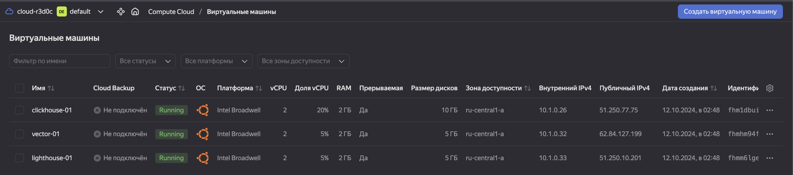
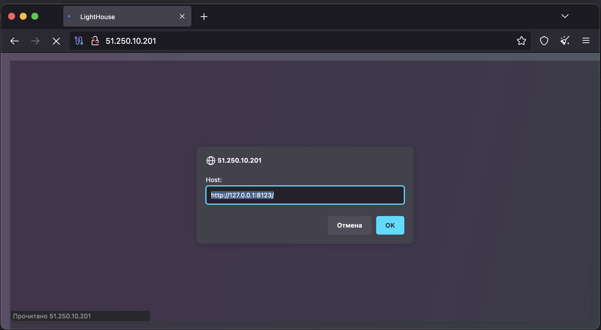

# Домашнее задание к занятию 3 «Использование Ansible»

## Подготовка к выполнению

1. Подготовьте в Yandex Cloud три хоста: для `clickhouse`, для `vector` и для `lighthouse`.
2. Репозиторий LightHouse находится [по ссылке](https://github.com/VKCOM/lighthouse).

## Основная часть

1. Допишите playbook: нужно сделать ещё один play, который устанавливает и настраивает LightHouse.
2. При создании tasks рекомендую использовать модули: `get_url`, `template`, `yum`, `apt`.
3. Tasks должны: скачать статику LightHouse, установить Nginx или любой другой веб-сервер, настроить его конфиг для открытия LightHouse, запустить веб-сервер.
4. Подготовьте свой inventory-файл `prod.yml`.
5. Запустите `ansible-lint site.yml` и исправьте ошибки, если они есть.
6. Попробуйте запустить playbook на этом окружении с флагом `--check`.
7. Запустите playbook на `prod.yml` окружении с флагом `--diff`. Убедитесь, что изменения на системе произведены.
8. Повторно запустите playbook с флагом `--diff` и убедитесь, что playbook идемпотентен.
9. Подготовьте README.md-файл по своему playbook. В нём должно быть описано: что делает playbook, какие у него есть параметры и теги.
10. Готовый playbook выложите в свой репозиторий, поставьте тег `08-ansible-03-yandex` на фиксирующий коммит, в ответ предоставьте ссылку на него.

---

#### Решение 

0. Создал инфру через `terrafrom` проект терраформа тоже приложил, создаю три хоста [`clickhouse-01`, `lighthouse-01`, `vector-01`] в которую будет производится установка, за основу взял `Ubuntu`, специально сделал генератор `yml` инвентори файла.



1. Проект взял из прошлой задачи, добавил еще 2 роли (установка/настройка nginx, lighthouse), так же добавил передачу логов из вектор в clickhouse. Струтура проекта:

    ```bash
    alekseykashin@MBP-Aleksej playbook % tree
    .
    ├── README.md
    ├── group_vars
    │   └── clickhouse
    │       └── vars.yml
    ├── inventory
    │   └── hosts.yml
    ├── roles
    │   ├── clickhouse
    │   │   ├── handlers
    │   │   │   └── main.yml
    │   │   ├── tasks
    │   │   │   └── main.yaml
    │   │   └── vars
    │   │       └── main.yml
    │   ├── lighthouse
    │   │   ├── tasks
    │   │   │   └── main.yml
    │   │   ├── templates
    │   │   │   └── nginx.lighthouse.conf.j2
    │   │   └── vars
    │   │       └── main.yml
    │   ├── nginx
    │   │   ├── handlers
    │   │   │   └── main.yml
    │   │   ├── tasks
    │   │   │   └── main.yml
    │   │   ├── templates
    │   │   │   └── nginx.conf.j2
    │   │   └── vars
    │   │       └── main.yml
    │   └── vector
    │       ├── handlers
    │       │   └── main.yml
    │       ├── tasks
    │       │   └── main.yml
    │       ├── templates
    │       │   ├── vector.config.j2
    │       │   └── vector.service.j2
    │       └── vars
    │           └── main.yml
    └── site.yml

    23 directories, 19 files
    alekseykashin@MBP-Aleksej playbook % 
    ```

2. Лог запуска [playbook_log](playbook.log)

3. Проверяем что логи из c хоста где развернут `Vector` отливаются в `Clickhouse`, заходим на сервер проверяем табличку `server_log` схемы `vector`

```bash
alekseykashin@MBP-Aleksej playbook % ssh ubuntu@51.250.77.75                                     
Welcome to Ubuntu 20.04.6 LTS (GNU/Linux 5.4.0-196-generic x86_64)

 * Documentation:  https://help.ubuntu.com
 * Management:     https://landscape.canonical.com
 * Support:        https://ubuntu.com/pro
New release '22.04.5 LTS' available.
Run 'do-release-upgrade' to upgrade to it.

Last login: Sat Oct 12 00:21:21 2024 from 94.102.126.225
ubuntu@fhm1dbui8jr48opn2t1j:~$ clickhouse-client
ClickHouse client version 24.9.2.42 (official build).
Connecting to localhost:9000 as user default.
Connected to ClickHouse server version 24.9.2.

Warnings:
 * Linux threads max count is too low. Check /proc/sys/kernel/threads-max
 * Available memory at server startup is too low (2GiB).
 * Maximum number of threads is lower than 30000. There could be problems with handling a lot of simultaneous queries.

fhm1dbui8jr48opn2t1j.auto.internal :) select * from vector.server_log;

SELECT *
FROM vector.server_log

Query id: c64b6942-c285-4026-a2ab-8f3735091618

    ┌─message───────────────────────────────────────────────────────────────────────────────────────────────────────────────────────────────────────────────────────┐
 1. │ <125>2 2024-10-12T00:22:16.701Z some.ga BryanHorsey 3448 ID240 - #hugops to everyone who has to deal with this                                                │
 2. │ <77>1 2024-10-12T00:22:17.701Z some.lanxess BronzeGamer 6706 ID425 - #hugops to everyone who has to deal with this                                            │
 3. │ <181>1 2024-10-12T00:22:18.701Z we.cricket b0rnc0nfused 8767 ID92 - Great Scott! We're never gonna reach 88 mph with the flux capacitor in its current state! │
 4. │ <101>1 2024-10-12T00:22:19.701Z make.rugby BryanHorsey 2399 ID173 - We're gonna need a bigger boat                                                            │
 5. │ <48>2 2024-10-12T00:22:20.701Z make.xn--mgberp4a5d4ar AmbientTech 2040 ID765 - #hugops to everyone who has to deal with this                                  │
 6. │ <87>2 2024-10-12T00:22:21.701Z names.ms devankoshal 6360 ID278 - Maybe we just shouldn't use computers                                                        │
 7. │ <108>1 2024-10-12T00:22:22.701Z some.ag CrucifiX 2688 ID300 - There's a breach in the warp core, captain                                                      │
 8. │ <127>1 2024-10-12T00:22:23.701Z some.yodobashi meln1ks 6843 ID109 - Pretty pretty pretty good                                                                 │
 9. │ <60>1 2024-10-12T00:22:24.701Z up.xn--3e0b707e ahmadajmi 7154 ID449 - You're not gonna believe what just happened                                             │
10. │ <96>1 2024-10-12T00:22:25.701Z names.observer Scarface 5869 ID648 - Pretty pretty pretty good                                                                 │
11. │ <111>1 2024-10-12T00:22:26.701Z some.xn--q7ce6a benefritz 7883 ID624 - Pretty pretty pretty good                                                              │
12. │ <63>2 2024-10-12T00:22:27.701Z names.reliance Scarface 3072 ID363 - There's a breach in the warp core, captain                                                │
13. │ <181>1 2024-10-12T00:22:28.701Z make.ikano jesseddy 5618 ID594 - Pretty pretty pretty good                                                                    │
14. │ <190>1 2024-10-12T00:22:29.701Z for.mit AnthraX 9697 ID42 - Maybe we just shouldn't use computers                                                             │
15. │ <103>2 2024-10-12T00:22:30.701Z random.xn--s9brj9c benefritz 3700 ID779 - Take a breath, let it go, walk away                                                 │
16. │ <49>1 2024-10-12T00:22:31.701Z names.xn--11b4c3d BronzeGamer 9370 ID718 - Take a breath, let it go, walk away                                                 │
17. │ <60>1 2024-10-12T00:22:32.701Z random.gmo meln1ks 5085 ID417 - There's a breach in the warp core, captain                                                     │
18. │ <31>1 2024-10-12T00:22:33.701Z make.auto meln1ks 4676 ID239 - You're not gonna believe what just happened                                                     │
19. │ <149>2 2024-10-12T00:22:34.701Z random.wtf AnthraX 2286 ID870 - #hugops to everyone who has to deal with this                                                 │
20. │ <107>2 2024-10-12T00:22:35.701Z we.travelersinsurance benefritz 5624 ID700 - Pretty pretty pretty good                                                        │
21. │ <68>1 2024-10-12T00:22:36.701Z we.ruhr BryanHorsey 4699 ID586 - You're not gonna believe what just happened                                                   │
22. │ <124>1 2024-10-12T00:22:37.701Z we.hair AmbientTech 8556 ID536 - #hugops to everyone who has to deal with this                                                │
23. │ <138>2 2024-10-12T00:22:38.701Z make.se BronzeGamer 8395 ID284 - #hugops to everyone who has to deal with this                                                │
    └───────────────────────────────────────────────────────────────────────────────────────────────────────────────────────────────────────────────────────────────┘

23 rows in set. Elapsed: 0.003 sec. 

fhm1dbui8jr48opn2t1j.auto.internal :) 

```

4. Проверяем что хост `lighthouse-01` открывает стартовую страничку




5. Запускаем проверку линтером `ansible-lint site.yml`, ошибок не обнаружили

```bash
alekseykashin@MBP-Aleksej playbook % ansible-lint site.yml

Passed: 0 failure(s), 0 warning(s) on 12 files. Last profile that met the validation criteria was 'production'.
alekseykashin@MBP-Aleksej playbook % 
```

6. Попробуем запустить playbook на этом окружении с флагом `--check`, файл с логом [playbook_check](playbook_check.log)

7. Запусткам playbook на `prod.yml` окружении с флагом `--diff`. Убеждаемся что изменения на системе произведены, файл с логом [playbook_diff](playbook_diff.log)

7. Повторно запускаем playbook с флагом --diff и убеждаемся, что playbook идемпотентен, файл с логом [playbook_diff second](<playbook_diff second.log>)


### Как оформить решение задания

Выполненное домашнее задание пришлите в виде ссылки на .md-файл в вашем репозитории.

---
