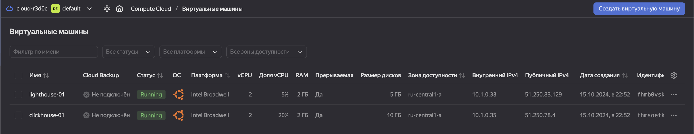
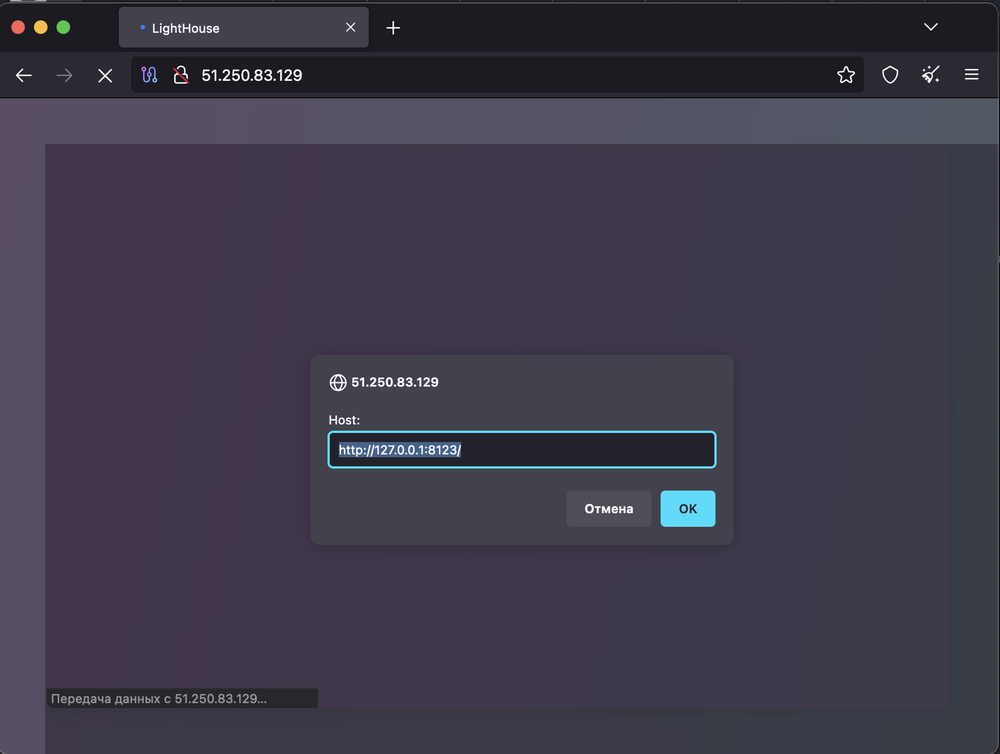

# Домашнее задание к занятию 4 «Работа с roles»

## Подготовка к выполнению

1. * Необязательно. Познакомьтесь с [LightHouse](https://youtu.be/ymlrNlaHzIY?t=929).
2. Создайте два пустых публичных репозитория в любом своём проекте: vector-role и lighthouse-role.
3. Добавьте публичную часть своего ключа к своему профилю на GitHub.

## Основная часть

Ваша цель — разбить ваш playbook на отдельные roles. 

Задача — сделать roles для ClickHouse, Vector и LightHouse и написать playbook для использования этих ролей. 

Ожидаемый результат — существуют три ваших репозитория: два с roles и один с playbook.

**Что нужно сделать**

1. Создайте в старой версии playbook файл `requirements.yml` и заполните его содержимым:

   ```yaml
---
  - src: git@github.com:AlexeySetevoi/ansible-clickhouse.git
    scm: git
    version: "1.13"
    name: clickhouse 
   ```

2. При помощи `ansible-galaxy` скачайте себе эту роль.
3. Создайте новый каталог с ролью при помощи `ansible-galaxy role init vector-role`.
4. На основе tasks из старого playbook заполните новую role. Разнесите переменные между `vars` и `default`. 
5. Перенести нужные шаблоны конфигов в `templates`.
6. Опишите в `README.md` обе роли и их параметры. Пример качественной документации ansible role [по ссылке](https://github.com/cloudalchemy/ansible-prometheus).
7. Повторите шаги 3–6 для LightHouse. Помните, что одна роль должна настраивать один продукт.
8. Выложите все roles в репозитории. Проставьте теги, используя семантическую нумерацию. Добавьте roles в `requirements.yml` в playbook.
9. Переработайте playbook на использование roles. Не забудьте про зависимости LightHouse и возможности совмещения `roles` с `tasks`.
10. Выложите playbook в репозиторий.
11. В ответе дайте ссылки на оба репозитория с roles и одну ссылку на репозиторий с playbook.

#### Решение 

1. Создаем новый каталог `playbook` и внутри создаем файл с зависимостями `requirements.yml`, добавляем репу на проект 

```bash
alekseykashin@MBP-Aleksej 08-ansible-04-role % mkdir playbook
alekseykashin@MBP-Aleksej 08-ansible-04-role % cd playbook 
alekseykashin@MBP-Aleksej playbook % nano requirements.yml
alekseykashin@MBP-Aleksej playbook % cat requirements.yml
---
  - src: git@github.com:AlexeySetevoi/ansible-clickhouse.git
    scm: git
    version: "1.13"
    name: clickhouse

alekseykashin@MBP-Aleksej playbook % 
```

2. Тут работы созданию ролей `lighthouse` и `vector`, но они остались за кадром (очень много пришлось бы расписывать) а так же созданию репозиториев в `git`

    * Ссылка на репозитори роли [Vector](https://github.com/x0r1x/ansible-vector/tree/v0.0.1)
    * Ссылка на репозиторй роли [Lighthouse](https://github.com/x0r1x/ansible-lighthouse/tree/v0.0.1)

3. Добавляем новые зависимости в `requirements.yml`

```bash
alekseykashin@MBP-Aleksej playbook % cat requirements.yml 
---
  - src: git@github.com:AlexeySetevoi/ansible-clickhouse.git
    scm: git
    version: "1.13"
    name: clickhouse
  - src: git@github.com:x0r1x/ansible-lighthouse.git
    scm: git
    version: "v0.0.1"
    name: lighthouse
  - src: git@github.com:x0r1x/ansible-vector.git
    scm: git
    version: "v0.0.1"
    name: vector
alekseykashin@MBP-Aleksej playbook % 
```

4. Cкачиваем зависимости

```bash 
alekseykashin@MBP-Aleksej playbook % ansible-galaxy install -r requirements.yml
Starting galaxy role install process
- clickhouse (1.13) is already installed, skipping.
- extracting lighthouse to /Users/alekseykashin/.ansible/roles/lighthouse
- lighthouse (v0.0.1) was installed successfully
- extracting vector to /Users/alekseykashin/.ansible/roles/vector
- vector (v0.0.1) was installed successfully
```

5. Перемещаем их в наш проект в папку `roles`

```bash
alekseykashin@MBP-Aleksej playbook % ansible-galaxy install -r requirements.yml --roles-path roles 
Starting galaxy role install process
- extracting clickhouse to /Users/alekseykashin/nettology/mnt-homeworks/08-ansible-04-role/playbook/roles/clickhouse
- clickhouse (1.13) was installed successfully
- extracting lighthouse to /Users/alekseykashin/nettology/mnt-homeworks/08-ansible-04-role/playbook/roles/lighthouse
- lighthouse (v0.0.1) was installed successfully
- extracting vector to /Users/alekseykashin/nettology/mnt-homeworks/08-ansible-04-role/playbook/roles/vector
- vector (v0.0.1) was installed successfully
alekseykashin@MBP-Aleksej playbook % 
```

6. Создаем два хоста через `terrafrom`



  переносим их в инветори

```bash
alekseykashin@MBP-Aleksej playbook % cat inventory/hosts.yml 
---
clickhouse:
  hosts:
    clickhouse-01: 
      ansible_host: 51.250.78.4
lighthouse:
  hosts:
    lighthouse-01: 
      ansible_host: 51.250.83.129
alekseykashin@MBP-Aleksej playbook % 
```

7. В `playbook` прописываем для группы хостов `clickhouse`, установку и настройку роли `clickhouse`, прописываем `clickhouse_dbs_custom` для создания (при конфигурации) собственной схемы `vector` на сервере, создаем таблицу `server_log` в схему `vector` для сохранине логов.

```yaml
- name: Install Clickhouse
  hosts: clickhouse
  become: true
  vars:
    clickhouse_dbs_custom:
      - { name: vector, state: present }
    clickhouse_dbs_table_custom:
      - { db: vector, table: server_log }
  roles:
    - clickhouse
  post_tasks:
    - name: Create table on schema for Vector service
      ansible.builtin.command: "clickhouse-client -q 'CREATE TABLE {{ item.db }}.{{ item.table }}(message String) ENGINE = TinyLog();'"
      with_items: "{{ clickhouse_dbs_table_custom }}"
      register: create_table
      failed_when: create_table.rc != 0 and create_table.rc != 57
      changed_when: create_table.rc == 0
```

8. В `playbook` прописываем для группы хостов `clickhouse`, установку и настройку роли `vector` прописываем config, настраиваем сохрание логов в таблицу `server_log` схемы `vector`

```yaml
- name: Install Vector
  hosts: clickhouse
  become: true
  vars:
    vector_config:
      sources:
        demo_logs:
          type: demo_logs
          format: syslog
        in:
          type: stdin
      sinks:
        to_clickhouse:
          type: clickhouse
          inputs:
            - demo_logs
          database: vector
          endpoint: http://localhost:8123
          table: server_log
          compression: gzip
          healthcheck: true
          skip_unknown_fields: true
  roles:
    - vector
```

8. В `playbook` прописываем для группы хостов `lighthouse`, установку и настройку роли `lighthouse`

```yaml
- name: Install Lighthouse
  hosts: lighthouse
  become: true
  roles:
    - lighthouse
```

9. Запускаем `playbook`, убеждаемся что сконфигурировалось без ошибок [play_log](playbook.log)

10. Проверяем что логи `vector` генерит логи и они сохраняются в `clickhouse`

```bash
Last login: Tue Oct 15 20:19:28 2024 from 94.102.126.225
ubuntu@fhmsoefk6620nq1qtm70:~$ vector
2024-10-15T20:23:58.122725Z  INFO vector::app: Log level is enabled. level="info"
2024-10-15T20:23:58.123433Z  INFO vector::app: Loading configs. paths=["/etc/vector/vector.yaml"]
2024-10-15T20:23:58.125583Z  WARN vector::config::loading: Source "in" has no consumers
2024-10-15T20:23:58.126810Z  INFO vector::sources::file_descriptors: Capturing stdin.
2024-10-15T20:23:58.171634Z  INFO vector::topology::running: Running healthchecks.
2024-10-15T20:23:58.171790Z  INFO vector: Vector has started. debug="false" version="0.41.1" arch="x86_64" revision="745babd 2024-09-11 14:55:36.802851761"
2024-10-15T20:23:58.171812Z  INFO vector::app: API is disabled, enable by setting `api.enabled` to `true` and use commands like `vector top`.
2024-10-15T20:23:58.178315Z  INFO vector::topology::builder: Healthcheck passed.
^C2024-10-15T20:24:00.960918Z  INFO vector::signal: Signal received. signal="SIGINT"
2024-10-15T20:24:00.961124Z  INFO vector: Vector has stopped.
2024-10-15T20:24:00.962534Z  INFO vector::topology::running: Shutting down... Waiting on running components. remaining_components="to_clickhouse, demo_logs" time_remaining="59 seconds left"
ubuntu@fhmsoefk6620nq1qtm70:~$ clickhouse-client
ClickHouse client version 24.9.2.42 (official build).
Connecting to localhost:9000 as user default.
Connected to ClickHouse server version 24.9.2.

Warnings:
 * Linux threads max count is too low. Check /proc/sys/kernel/threads-max
 * Available memory at server startup is too low (2GiB).
 * Maximum number of threads is lower than 30000. There could be problems with handling a lot of simultaneous queries.

fhmsoefk6620nq1qtm70.auto.internal :) select * from vector.server_log

SELECT *
FROM vector.server_log

Query id: a82fb7b0-12d8-4d1d-93de-c195bcdf8ba5

     ┌─message────────────────────────────────────────────────────────────────────────────────────────────────────────────────────────────────────────────────────────────┐
  1. │ <155>2 2024-10-15T20:19:28.991Z up.norton meln1ks 8472 ID393 - There's a breach in the warp core, captain                                                          │
  2. │ <14>1 2024-10-15T20:19:29.991Z up.merckmsd BryanHorsey 7452 ID95 - A bug was encountered but not in Vector, which doesn't have bugs                                │
  3. │ <121>2 2024-10-15T20:19:30.992Z for.hyundai b0rnc0nfused 8228 ID750 - Pretty pretty pretty good                                                                    │
  4. │ <97>1 2024-10-15T20:19:31.991Z make.xn--42c2d9a devankoshal 5256 ID567 - We're gonna need a bigger boat                                                            │
  5. │ <83>1 2024-10-15T20:19:32.991Z random.as shaneIxD 7952 ID22 - There's a breach in the warp core, captain                                                           │
  6. │ <161>1 2024-10-15T20:19:33.992Z up.compare benefritz 1633 ID754 - Maybe we just shouldn't use computers                                                            │
  7. │ <81>2 2024-10-15T20:19:34.991Z up.globo devankoshal 7204 ID197 - Pretty pretty pretty good  

...

309. │ <112>1 2024-10-15T20:24:32.991Z random.rehab jesseddy 5541 ID445 - We're gonna need a bigger boat                                                                  │
310. │ <44>1 2024-10-15T20:24:33.992Z random.company meln1ks 4849 ID332 - #hugops to everyone who has to deal with this                                                   │
311. │ <8>2 2024-10-15T20:24:34.992Z random.lgbt shaneIxD 2194 ID183 - You're not gonna believe what just happened                                                        │
312. │ <171>2 2024-10-15T20:24:35.991Z make.ke AmbientTech 9346 ID165 - We're gonna need a bigger boat                                                                    │
     └─message────────────────────────────────────────────────────────────────────────────────────────────────────────────────────────────────────────────────────────────┘

312 rows in set. Elapsed: 0.005 sec. 

fhmsoefk6620nq1qtm70.auto.internal :)  
```

11. Проверяем что хост с достуен `lighthouse`



---

### Как оформить решение задания

Выполненное домашнее задание пришлите в виде ссылки на .md-файл в вашем репозитории.

---
