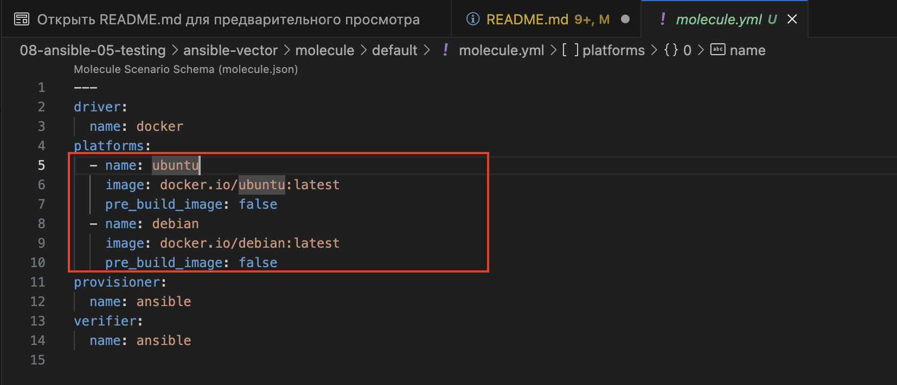
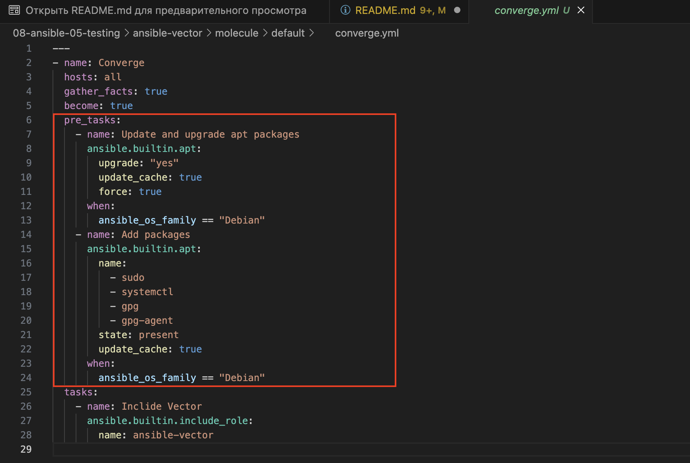
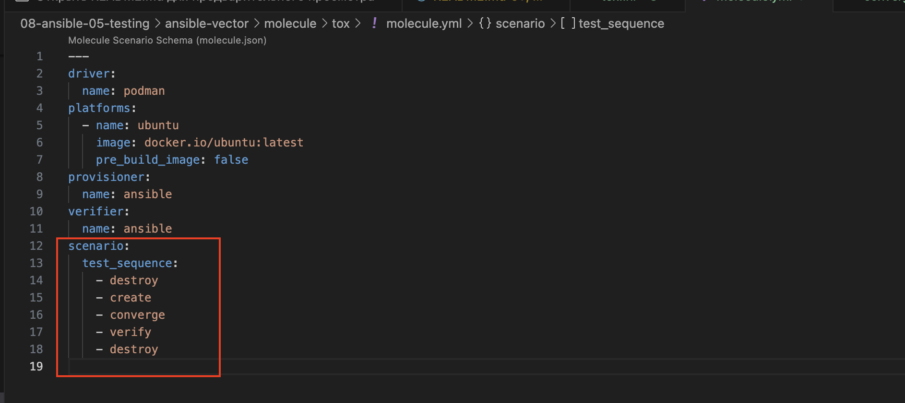

# Домашнее задание к занятию 5 «Тестирование roles»

## Подготовка к выполнению

1. Установите molecule и его драйвера: `pip3 install "molecule molecule_docker molecule_podman`.
2. Выполните `docker pull aragast/netology:latest` —  это образ с podman, tox и несколькими пайтонами (3.7 и 3.9) внутри.

## Основная часть

Ваша цель — настроить тестирование ваших ролей. 

Задача — сделать сценарии тестирования для vector. 

Ожидаемый результат — все сценарии успешно проходят тестирование ролей.

### Molecule

1. Запустите  `molecule test -s ubuntu_xenial` (или с любым другим сценарием, не имеет значения) внутри корневой директории clickhouse-role, посмотрите на вывод команды. Данная команда может отработать с ошибками или не отработать вовсе, это нормально. Наша цель - посмотреть как другие в реальном мире используют молекулу И из чего может состоять сценарий тестирования.
2. Перейдите в каталог с ролью vector-role и создайте сценарий тестирования по умолчанию при помощи `molecule init scenario --driver-name docker`.
3. Добавьте несколько разных дистрибутивов (oraclelinux:8, ubuntu:latest) для инстансов и протестируйте роль, исправьте найденные ошибки, если они есть.
4. Добавьте несколько assert в verify.yml-файл для  проверки работоспособности vector-role (проверка, что конфиг валидный, проверка успешности запуска и др.). 
5. Запустите тестирование роли повторно и проверьте, что оно прошло успешно.
5. Добавьте новый тег на коммит с рабочим сценарием в соответствии с семантическим версионированием.

#### Решение

1. Запустил тест `ubuntu_xenial` на `molecule` [ansible-clickhouse](ansible-clickhouse.log)
2. Создаем сценарий тестировия для `molecule`

```bash
alekseykashin@MBP-Aleksej ansible-vector % molecule init scenario --driver-name docker
INFO     Initializing new scenario default...

PLAY [Create a new molecule scenario] ******************************************

TASK [Check if destination folder exists] **************************************
changed: [localhost]

TASK [Check if destination folder is empty] ************************************
ok: [localhost]

TASK [Fail if destination folder is not empty] *********************************
skipping: [localhost]

TASK [Expand templates] ********************************************************
skipping: [localhost] => (item=molecule/default/destroy.yml) 
changed: [localhost] => (item=molecule/default/molecule.yml)
changed: [localhost] => (item=molecule/default/converge.yml)
skipping: [localhost] => (item=molecule/default/create.yml) 

PLAY RECAP *********************************************************************
localhost                  : ok=3    changed=2    unreachable=0    failed=0    skipped=1    rescued=0    ignored=0

INFO     Initialized scenario in /Users/alekseykashin/nettology/mnt-homeworks/08-ansible-05-testing/ansible-vector/molecule/default successfully.
alekseykashin@MBP-Aleksej ansible-vector % 
```

2. Дальше я создал создал сценарий тестирования для семейства OS `Debian`, выбрал 2 образа , так же добавил недостоющие пакеты , и настроил две проверки (что сервис активен и что конфигурация валидна) 

3. Запускаю убеждаюсь что все работает [molucule_log](ansible-vector_molecule_test.log)

4. Заливаю `git` проект [vector](https://github.com/x0r1x/ansible-vector/tree/v0.0.2)


### Tox

1. Добавьте в директорию с vector-role файлы из [директории](./example).
2. Запустите `docker run --privileged=True -v <path_to_repo>:/opt/vector-role -w /opt/vector-role -it aragast/netology:latest /bin/bash`, где path_to_repo — путь до корня репозитория с vector-role на вашей файловой системе.
3. Внутри контейнера выполните команду `tox`, посмотрите на вывод.
5. Создайте облегчённый сценарий для `molecule` с драйвером `molecule_podman`. Проверьте его на исполнимость.
6. Пропишите правильную команду в `tox.ini`, чтобы запускался облегчённый сценарий.
8. Запустите команду `tox`. Убедитесь, что всё отработало успешно.
9. Добавьте новый тег на коммит с рабочим сценарием в соответствии с семантическим версионированием.

После выполнения у вас должно получится два сценария molecule и один tox.ini файл в репозитории. Не забудьте указать в ответе теги решений Tox и Molecule заданий. В качестве решения пришлите ссылку на  ваш репозиторий и скриншоты этапов выполнения задания. 

#### Решение 

1. Для `molecule` создаем новую сценарий тестирования `tox`, меняем драйвер на `podman`.

```bash
alekseykashin@MBP-Aleksej ansible-vector % molecule init scenario tox --driver-name=podman         
INFO     Initializing new scenario tox...

PLAY [Create a new molecule scenario] ******************************************

TASK [Check if destination folder exists] **************************************
changed: [localhost]

TASK [Check if destination folder is empty] ************************************
ok: [localhost]

TASK [Fail if destination folder is not empty] *********************************
skipping: [localhost]

TASK [Expand templates] ********************************************************
skipping: [localhost] => (item=molecule/tox/destroy.yml) 
changed: [localhost] => (item=molecule/tox/molecule.yml)
changed: [localhost] => (item=molecule/tox/converge.yml)
skipping: [localhost] => (item=molecule/tox/create.yml) 

PLAY RECAP *********************************************************************
localhost                  : ok=3    changed=2    unreachable=0    failed=0    skipped=1    rescued=0    ignored=0

INFO     Initialized scenario in /Users/alekseykashin/nettology/mnt-homeworks/08-ansible-05-testing/ansible-vector/molecule/tox successfully.
```

2. Из сецнария `default` копируем [`converge`, `verify`], переопределенные этапы сценария
3. В `molecule.yml` меняем/упрощаем этапы последовательности прогона тестетов 
4. Настриваем `tox` на прогон сценария тестирования `molecule/tox`, делаем матрицу тестирования на питон [`3.9`, `3.12`] с одной стороны, а с другой стороны ansible [`2.12`, `2.17`], по сути должно получится 4 прогона.
5. Запускаем `tox`, убеждаемся что все отработало хорошо. 

```bash
INFO     Pruning extra files from scenario ephemeral directory
  py39-ansible212: OK (100.09=setup[8.04]+cmd[92.05] seconds)
  py39-ansible217: OK (79.91=setup[0.01]+cmd[79.90] seconds)
  py312-ansible212: OK (76.33=setup[7.70]+cmd[68.64] seconds)
  py312-ansible217: OK (77.74=setup[0.01]+cmd[77.73] seconds)
  congratulations :) (334.14 seconds)
alekseykashin@MBP-Aleksej ansible-vector % 
```

6. Заливаю `git` проект [vector](https://github.com/x0r1x/ansible-vector/tree/v0.0.3)

## Необязательная часть

1. Проделайте схожие манипуляции для создания роли LightHouse.
2. Создайте сценарий внутри любой из своих ролей, который умеет поднимать весь стек при помощи всех ролей.
3. Убедитесь в работоспособности своего стека. Создайте отдельный verify.yml, который будет проверять работоспособность интеграции всех инструментов между ними.
4. Выложите свои roles в репозитории.

В качестве решения пришлите ссылки и скриншоты этапов выполнения задания.

---

### Как оформить решение задания

Выполненное домашнее задание пришлите в виде ссылки на .md-файл в вашем репозитории.
