# Домашнее задание к занятию 7 «Жизненный цикл ПО»

## Подготовка к выполнению

1. Получить бесплатную версию Jira - <https://www.atlassian.com/ru/software/jira/work-management/free> (скопируйте ссылку в адресную строку). Вы можете воспользоваться любым(в том числе бесплатным vpn сервисом) если сайт у вас недоступен. Кроме того вы можете скачать [docker образ](https://hub.docker.com/r/atlassian/jira-software/#) и запустить на своем хосте self-managed версию jira.
2. Настроить её для своей команды разработки.
3. Создать доски Kanban и Scrum.
4. [Дополнительные инструкции от разработчика Jira](https://support.atlassian.com/jira-cloud-administration/docs/import-and-export-issue-workflows/).

## Основная часть

Необходимо создать собственные workflow для двух типов задач: bug и остальные типы задач. Задачи типа bug должны проходить жизненный цикл:

Создаю `worfklow`, в котором 2 процеса, 1 `bug_process` процесс только для типов запроса `bug`, 2 `main_process` процесс для остальных типов запроса, ниже скрины с отрисовкой диаграмы процессов

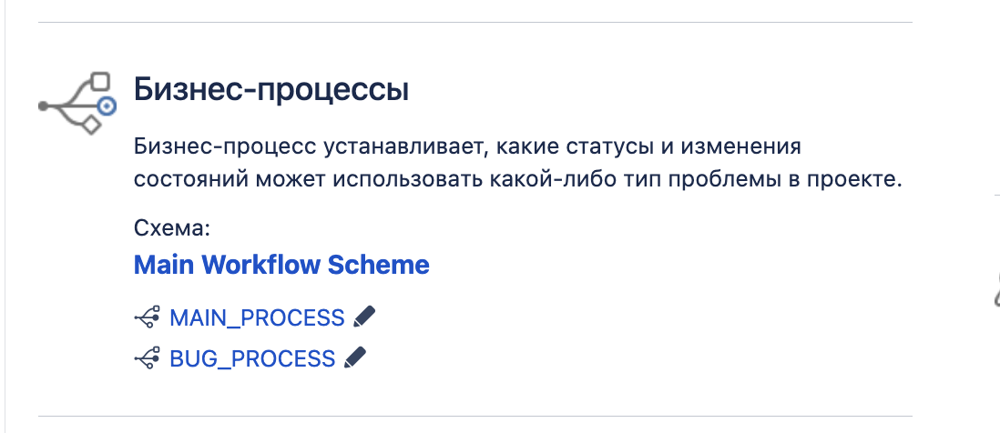

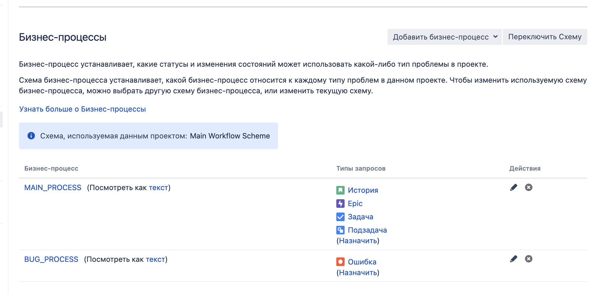

1. Open -> On reproduce.
2. On reproduce -> Open, Done reproduce.
3. Done reproduce -> On fix.
4. On fix -> On reproduce, Done fix.
5. Done fix -> On test.
6. On test -> On fix, Done.
7. Done -> Closed, Open.

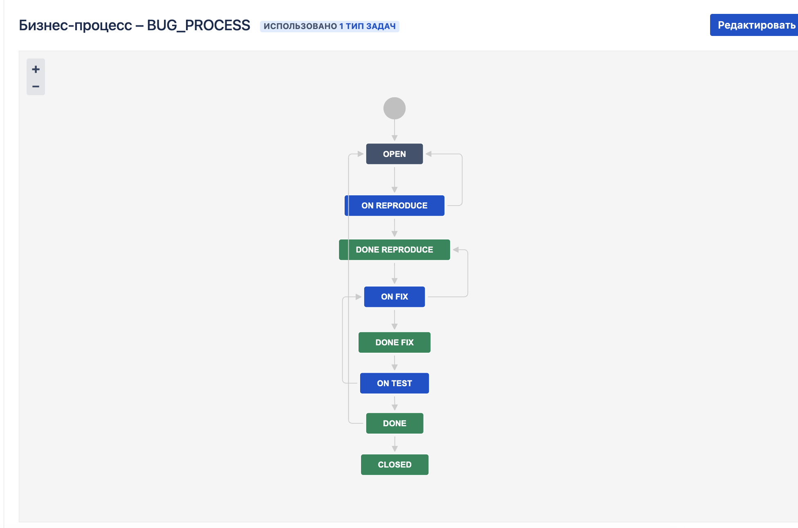

Остальные задачи должны проходить по упрощённому workflow:

1. Open -> On develop.
2. On develop -> Open, Done develop.
3. Done develop -> On test.
4. On test -> On develop, Done.
5. Done -> Closed, Open.

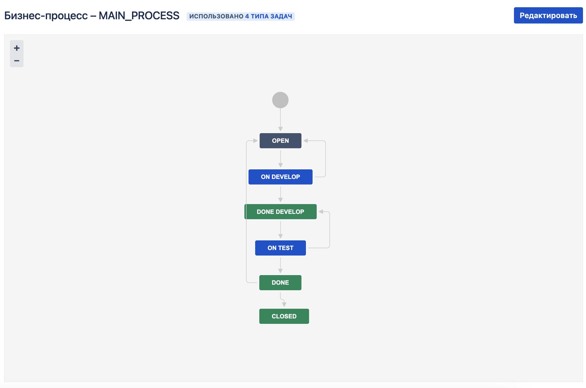

**Что нужно сделать**

Тут все по тексту, создаем 1 тикет с типом бага, 1 эпик, 2 тикета с типом таска, добавляем таски к эпику, проверяем `flow` по тикетам, создаем спринт, добавляем тикеты в спринт и стартуем

1. Создайте задачу с типом bug, попытайтесь провести его по всему workflow до Done.
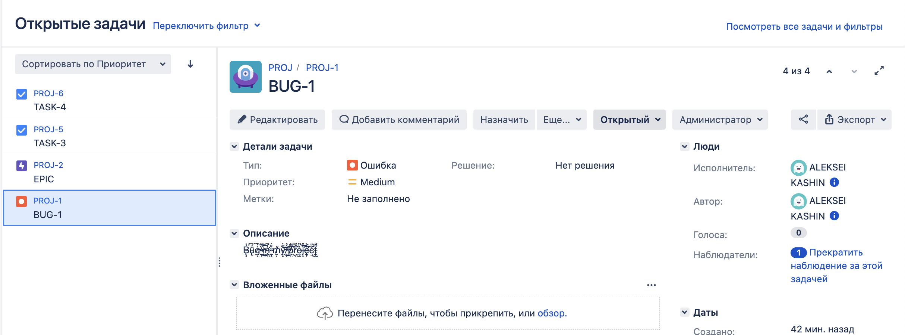
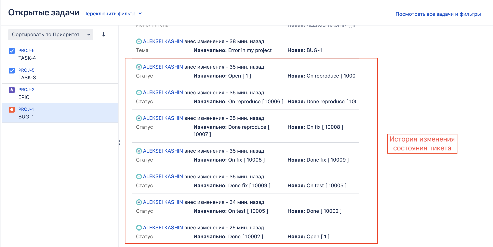
2. Создайте задачу с типом epic, к ней привяжите несколько задач с типом task, проведите их по всему workflow до Done.
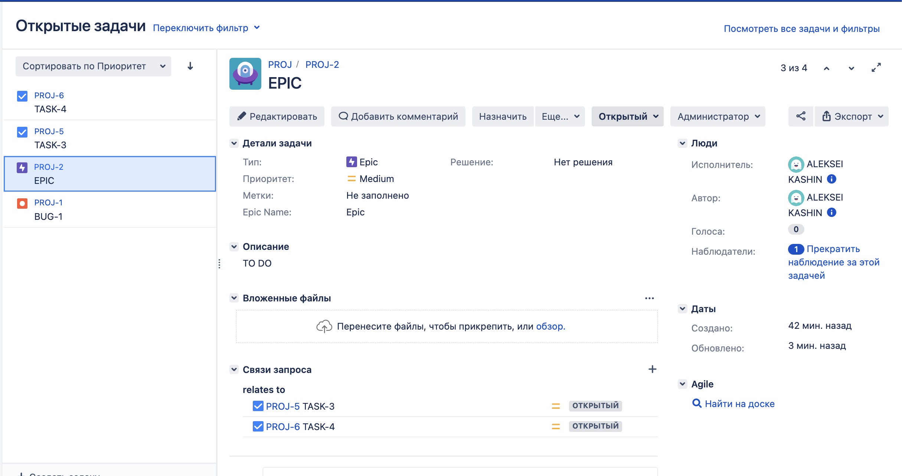
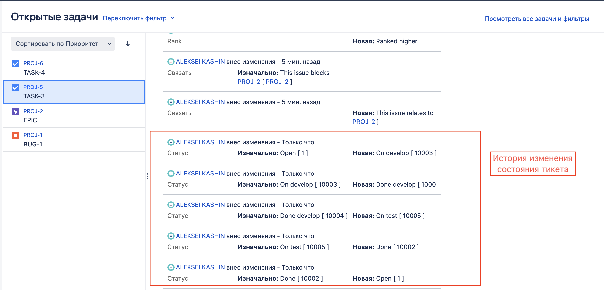
3. При проведении обеих задач по статусам используйте kanban.
4. Верните задачи в статус Open.
5. Перейдите в Scrum, запланируйте новый спринт, состоящий из задач эпика и одного бага, стартуйте спринт, проведите задачи до состояния Closed. Закройте спринт.
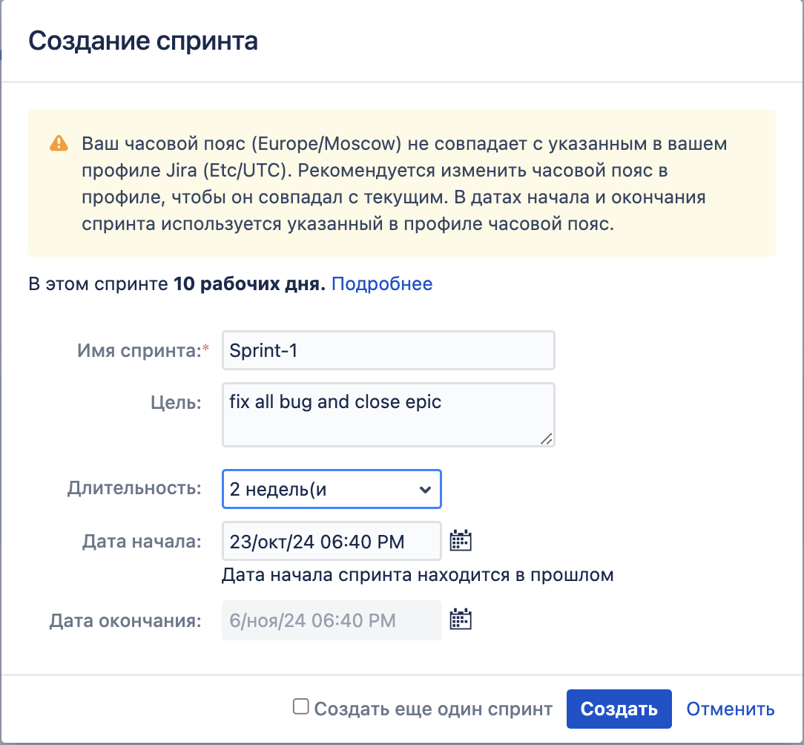
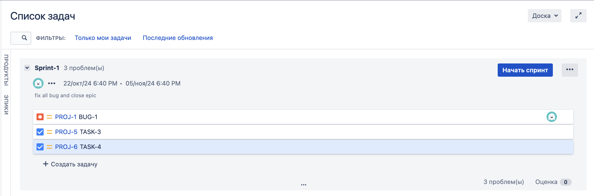
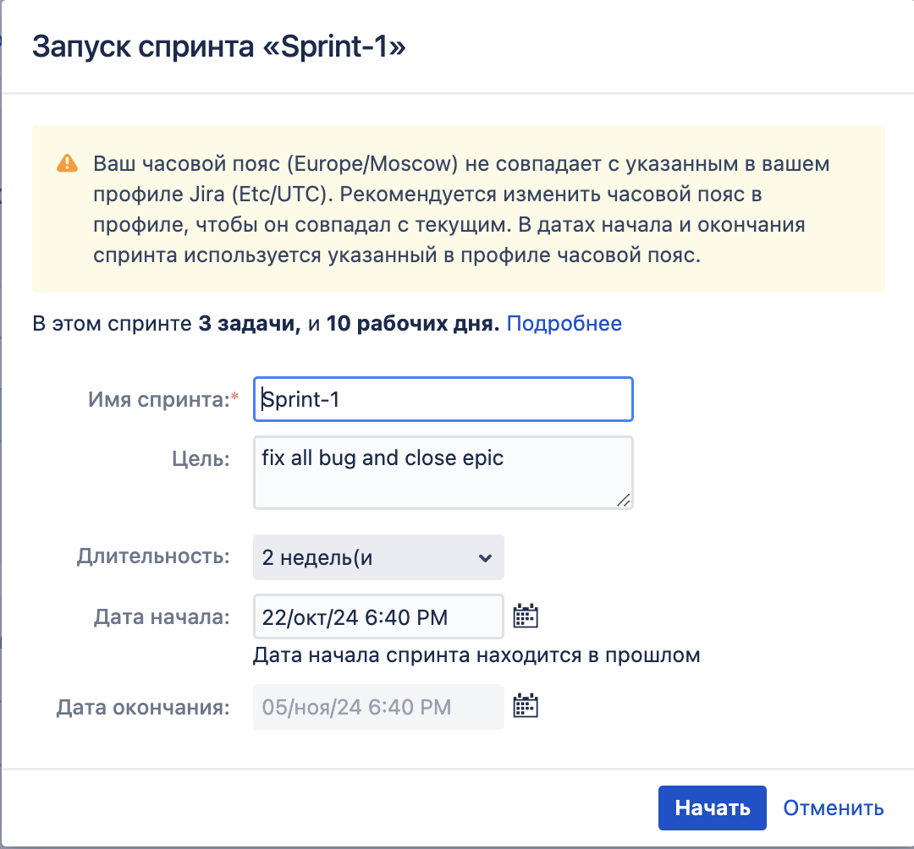
Тут надо правильно настроить переходы по канбан доске, если настроить правильно, останется просто по состояниям попереходить
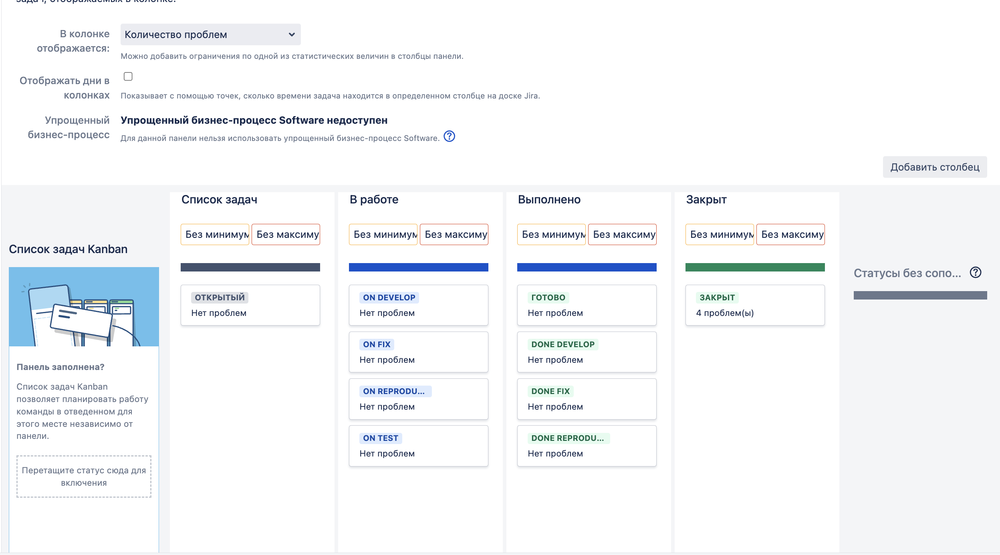
Тут забыл начальное состояние заскринить, все тикеты успешно перенешли в состояние `закрыт`
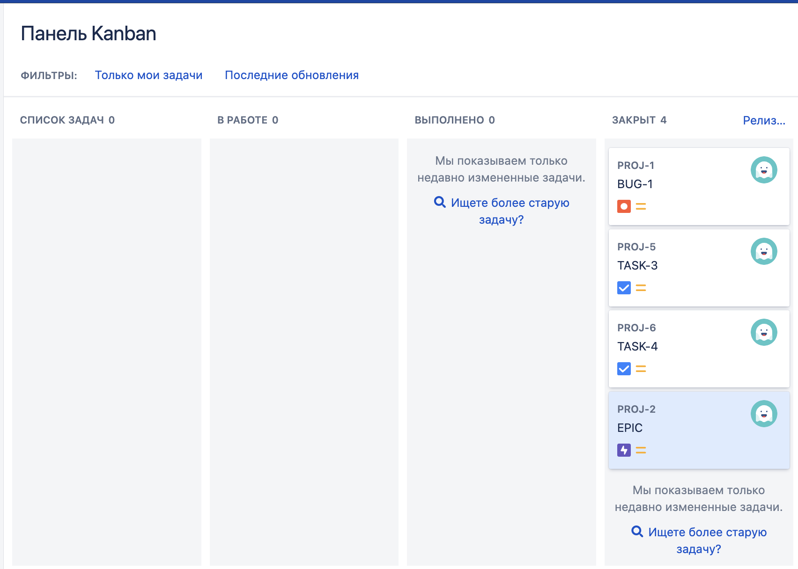
6. Если всё отработалось в рамках ожидания — выгрузите схемы workflow для импорта в XML. Файлы с workflow и скриншоты workflow приложите к решению задания.
Прикладываю схемы процессов  [MAIN_PROCESS](MAIN_PROCESS.xml) [BUG_PROCESS](BUG_PROCESS.xml)

---

### Как оформить решение задания

Выполненное домашнее задание пришлите в виде ссылки на .md-файл в вашем репозитории.

---
