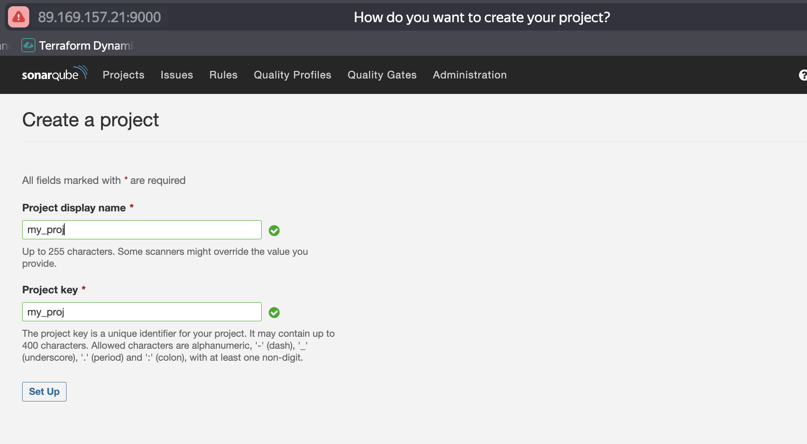
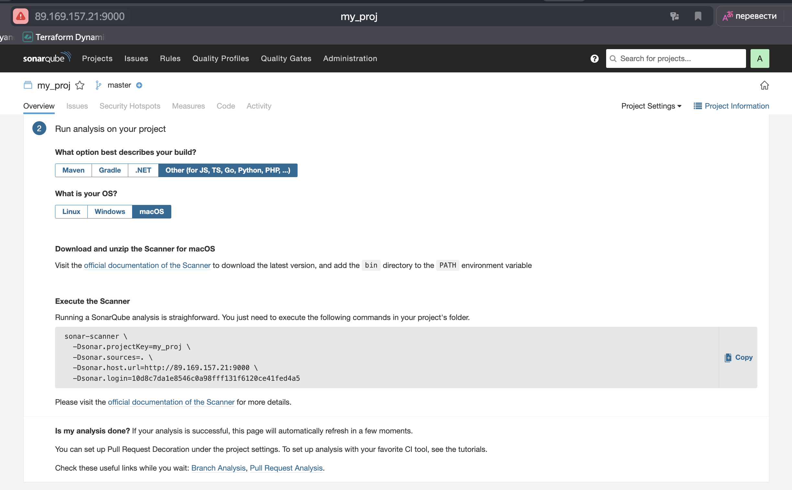
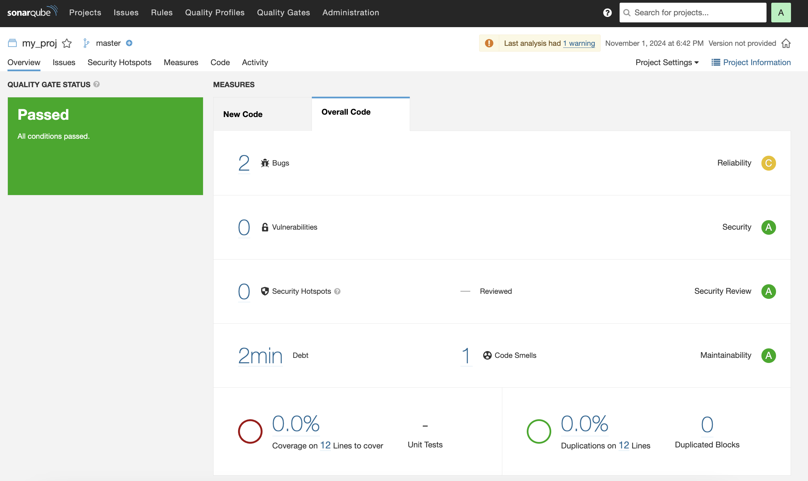
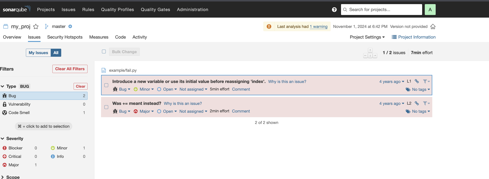
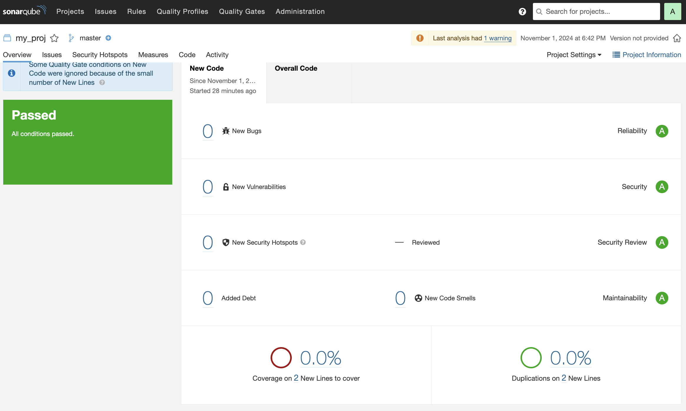
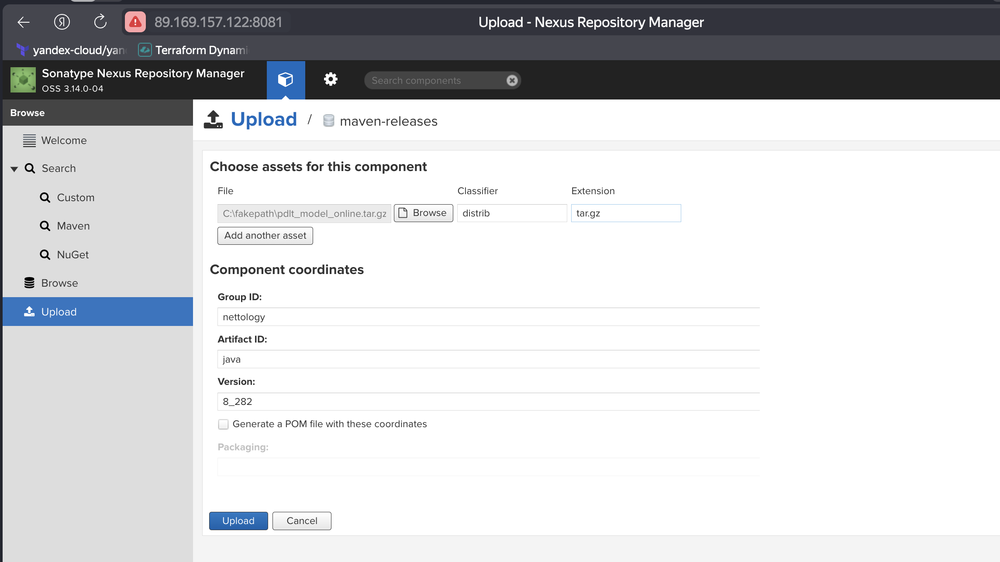
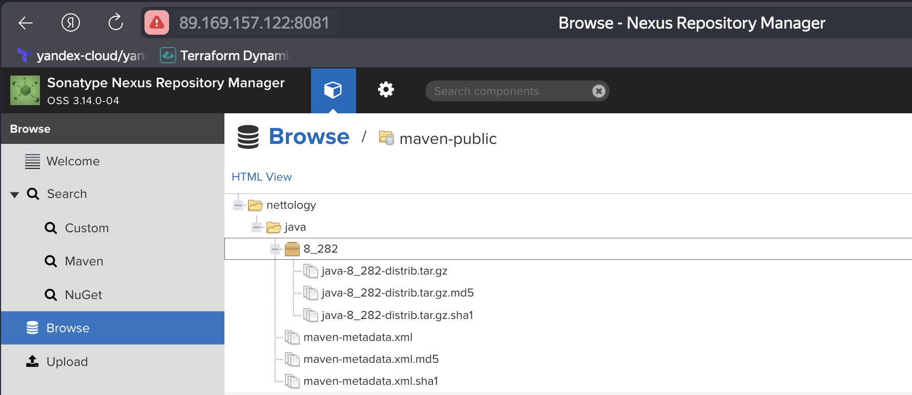
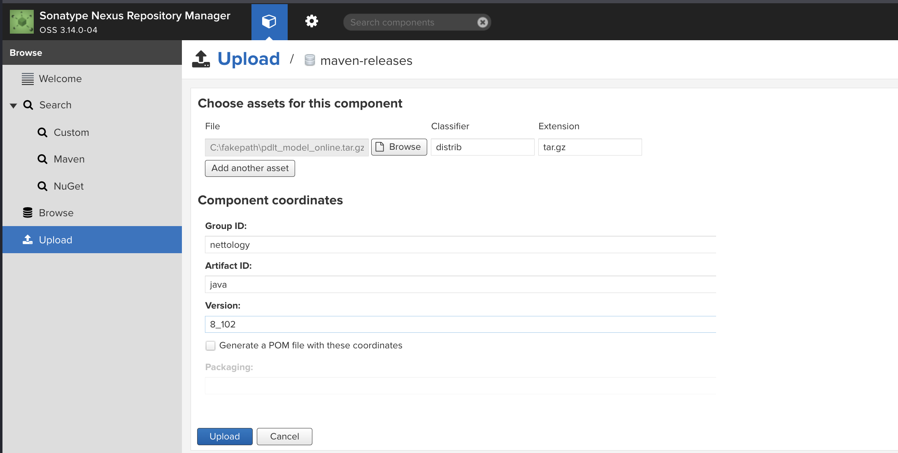
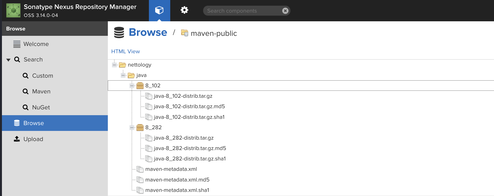

# Домашнее задание к занятию 9 «Процессы CI/CD»

## Подготовка к выполнению

1. Создайте два VM в Yandex Cloud с параметрами: 2CPU 4RAM Centos7 (остальное по минимальным требованиям).
2. Пропишите в [inventory](./infrastructure/inventory/cicd/hosts.yml) [playbook](./infrastructure/site.yml) созданные хосты.
3. Добавьте в [files](./infrastructure/files/) файл со своим публичным ключом (id_rsa.pub). Если ключ называется иначе — найдите таску в плейбуке, которая использует id_rsa.pub имя, и исправьте на своё.
4. Запустите playbook, ожидайте успешного завершения.
5. Проверьте готовность SonarQube через [браузер](http://localhost:9000).
6. Зайдите под admin\admin, поменяйте пароль на свой.
7. Проверьте готовность Nexus через [бразуер](http://localhost:8081).
8. Подключитесь под admin\admin123, поменяйте пароль, сохраните анонимный доступ.

## Знакомоство с SonarQube

### Основная часть

1. Создайте новый проект, название произвольное.
2. Скачайте пакет sonar-scanner, который вам предлагает скачать SonarQube.
3. Сделайте так, чтобы binary был доступен через вызов в shell (или поменяйте переменную PATH, или любой другой, удобный вам способ).
4. Проверьте `sonar-scanner --version`.
5. Запустите анализатор против кода из директории [example](./example) с дополнительным ключом `-Dsonar.coverage.exclusions=fail.py`.
6. Посмотрите результат в интерфейсе.
7. Исправьте ошибки, которые он выявил, включая warnings.
8. Запустите анализатор повторно — проверьте, что QG пройдены успешно.
9. Сделайте скриншот успешного прохождения анализа, приложите к решению ДЗ.

#### Решение

1. Создаем проект




2. Локально проверяем код



3. Скачиваем клиент sonar-scanner и проверяем работу `sonar-scanner`

```bash
alekseykashin@MacBook-Pro-Aleksej src % sonar-scanner --version
18:30:47.908 INFO  Scanner configuration file: /opt/homebrew/Cellar/sonar-scanner/6.2.1.4610/libexec/conf/sonar-scanner.properties
18:30:47.910 INFO  Project root configuration file: NONE
18:30:47.918 INFO  SonarScanner CLI 6.2.1.4610
18:30:47.918 INFO  Java 23.0.1 Homebrew (64-bit)
18:30:47.920 INFO  Mac OS X 14.3.1 aarch64
alekseykashin@MacBook-Pro-Aleksej src % 
```

4. Проверяем код

```bash
alekseykashin@MacBook-Pro-Aleksej 09-ci-03-cicd % ls
README.md	example		image-1.png	image.png	infrastructure	mvn		terraform
alekseykashin@MacBook-Pro-Aleksej 09-ci-03-cicd % sonar-scanner \
  -Dsonar.projectKey=my_proj \
  -Dsonar.sources=./example \
  -Dsonar.host.url=http://89.169.157.21:9000 \
  -Dsonar.login=10d8c7da1e8546c0a98fff131f6120ce41fed4a5  \
  -Dsonar.coverage.exclusions=fail.py
18:40:59.838 INFO  Scanner configuration file: /opt/homebrew/Cellar/sonar-scanner/6.2.1.4610/libexec/conf/sonar-scanner.properties
18:40:59.840 INFO  Project root configuration file: NONE
18:40:59.847 INFO  SonarScanner CLI 6.2.1.4610
18:40:59.848 INFO  Java 23.0.1 Homebrew (64-bit)
18:40:59.850 INFO  Mac OS X 14.3.1 aarch64
18:40:59.873 INFO  User cache: /Users/alekseykashin/.sonar/cache
18:41:13.379 INFO  Communicating with SonarQube Server 9.1.0.47736
18:41:13.483 INFO  Load global settings
18:41:13.727 INFO  Load global settings (done) | time=244ms
18:41:13.729 INFO  Server id: 9CFC3560-AZLnQ-l_o7ykI0zgQgE7
18:41:13.733 INFO  User cache: /Users/alekseykashin/.sonar/cache
18:41:13.736 INFO  Load/download plugins
18:41:13.736 INFO  Load plugins index
18:41:13.861 INFO  Load plugins index (done) | time=125ms
18:42:45.851 INFO  Load/download plugins (done) | time=92115ms
18:42:46.020 INFO  Process project properties
18:42:46.023 INFO  Process project properties (done) | time=3ms
18:42:46.024 INFO  Execute project builders
18:42:46.024 INFO  Execute project builders (done) | time=0ms
18:42:46.027 INFO  Project key: my_proj
18:42:46.028 INFO  Base dir: /Users/alekseykashin/nettology/mnt-homeworks/09-ci-03-cicd
18:42:46.028 INFO  Working dir: /Users/alekseykashin/nettology/mnt-homeworks/09-ci-03-cicd/.scannerwork
18:42:46.067 INFO  Load project settings for component key: 'my_proj'
18:42:46.209 INFO  Load project settings for component key: 'my_proj' (done) | time=142ms
18:42:46.240 INFO  Load quality profiles
18:42:46.427 INFO  Load quality profiles (done) | time=187ms
18:42:46.437 INFO  Load active rules
18:42:51.544 INFO  Load active rules (done) | time=5107ms
18:42:51.582 INFO  Indexing files...
18:42:51.582 INFO  Project configuration:
18:42:51.582 INFO    Excluded sources for coverage: fail.py
18:42:51.757 INFO  1 file indexed
18:42:51.757 INFO  0 files ignored because of scm ignore settings
18:42:51.758 INFO  Quality profile for py: Sonar way
18:42:51.758 INFO  ------------- Run sensors on module my_proj
18:42:51.781 INFO  Load metrics repository
18:42:51.894 INFO  Load metrics repository (done) | time=113ms
18:42:52.207 INFO  Sensor Python Sensor [python]
18:42:52.208 WARN  Your code is analyzed as compatible with python 2 and 3 by default. This will prevent the detection of issues specific to python 2 or python 3. You can get a more precise analysis by setting a python version in your configuration via the parameter "sonar.python.version"
18:42:52.210 INFO  Starting global symbols computation
18:42:52.210 INFO  1 source file to be analyzed
18:42:52.212 INFO  Load project repositories
18:42:52.358 INFO  Load project repositories (done) | time=146ms
18:42:52.434 INFO  1/1 source file has been analyzed
18:42:52.434 INFO  Starting rules execution
18:42:52.434 INFO  1 source file to be analyzed
18:42:52.541 INFO  1/1 source file has been analyzed
18:42:52.541 INFO  Sensor Python Sensor [python] (done) | time=335ms
18:42:52.542 INFO  Sensor Cobertura Sensor for Python coverage [python]
18:42:52.545 INFO  Sensor Cobertura Sensor for Python coverage [python] (done) | time=4ms
18:42:52.545 INFO  Sensor PythonXUnitSensor [python]
18:42:52.546 INFO  Sensor PythonXUnitSensor [python] (done) | time=1ms
18:42:52.546 INFO  Sensor CSS Rules [cssfamily]
18:42:52.546 INFO  No CSS, PHP, HTML or VueJS files are found in the project. CSS analysis is skipped.
18:42:52.546 INFO  Sensor CSS Rules [cssfamily] (done) | time=0ms
18:42:52.546 INFO  Sensor JaCoCo XML Report Importer [jacoco]
18:42:52.547 INFO  'sonar.coverage.jacoco.xmlReportPaths' is not defined. Using default locations: target/site/jacoco/jacoco.xml,target/site/jacoco-it/jacoco.xml,build/reports/jacoco/test/jacocoTestReport.xml
18:42:52.547 INFO  No report imported, no coverage information will be imported by JaCoCo XML Report Importer
18:42:52.547 INFO  Sensor JaCoCo XML Report Importer [jacoco] (done) | time=1ms
18:42:52.547 INFO  Sensor C# Project Type Information [csharp]
18:42:52.547 INFO  Sensor C# Project Type Information [csharp] (done) | time=0ms
18:42:52.547 INFO  Sensor C# Analysis Log [csharp]
18:42:52.551 INFO  Sensor C# Analysis Log [csharp] (done) | time=4ms
18:42:52.551 INFO  Sensor C# Properties [csharp]
18:42:52.551 INFO  Sensor C# Properties [csharp] (done) | time=0ms
18:42:52.551 INFO  Sensor JavaXmlSensor [java]
18:42:52.551 INFO  Sensor JavaXmlSensor [java] (done) | time=0ms
18:42:52.551 INFO  Sensor HTML [web]
18:42:52.552 INFO  Sensor HTML [web] (done) | time=1ms
18:42:52.552 INFO  Sensor VB.NET Project Type Information [vbnet]
18:42:52.552 INFO  Sensor VB.NET Project Type Information [vbnet] (done) | time=0ms
18:42:52.552 INFO  Sensor VB.NET Analysis Log [vbnet]
18:42:52.555 INFO  Sensor VB.NET Analysis Log [vbnet] (done) | time=3ms
18:42:52.555 INFO  Sensor VB.NET Properties [vbnet]
18:42:52.555 INFO  Sensor VB.NET Properties [vbnet] (done) | time=0ms
18:42:52.557 INFO  ------------- Run sensors on project
18:42:52.562 INFO  Sensor Zero Coverage Sensor
18:42:52.564 INFO  Sensor Zero Coverage Sensor (done) | time=2ms
18:42:52.565 INFO  SCM Publisher SCM provider for this project is: git
18:42:52.566 INFO  SCM Publisher 1 source file to be analyzed
18:42:52.629 INFO  SCM Publisher 1/1 source file have been analyzed (done) | time=62ms
18:42:52.630 INFO  CPD Executor Calculating CPD for 1 file
18:42:52.632 INFO  CPD Executor CPD calculation finished (done) | time=2ms
18:42:52.658 INFO  Analysis report generated in 26ms, dir size=103,4 kB
18:42:52.666 INFO  Analysis report compressed in 8ms, zip size=14,6 kB
18:42:52.904 INFO  Analysis report uploaded in 238ms
18:42:52.905 INFO  ANALYSIS SUCCESSFUL, you can browse http://89.169.157.21:9000/dashboard?id=my_proj
18:42:52.905 INFO  Note that you will be able to access the updated dashboard once the server has processed the submitted analysis report
18:42:52.905 INFO  More about the report processing at http://89.169.157.21:9000/api/ce/task?id=AZLoZMwXo7ykI0zgQlKD
18:42:52.908 INFO  Analysis total time: 6.998 s
18:42:52.908 INFO  EXECUTION SUCCESS
18:42:52.908 INFO  Total time: 1:53.072s
alekseykashin@MacBook-Pro-Aleksej 09-ci-03-cicd % 
```




5. Правим код

```py
alekseykashin@MacBook-Pro-Aleksej 09-ci-03-cicd % cat ./example/fail.py 
def increment(index):
    index += 1
    return index
def get_square(numb):
    return pow(numb, 2)
def print_numb(numb):
    print("Number is {}".format(numb))

index = 0
while (index < 10):
    index = increment(index)
    print(get_square(index))%                                                                                                                                          alekseykashin@MacBook-Pro-Aleksej 09-ci-03-cicd % 
```

6. Проверяем код

```bash
alekseykashin@MacBook-Pro-Aleksej 09-ci-03-cicd % sonar-scanner \
  -Dsonar.projectKey=my_proj \
  -Dsonar.sources=./example \
  -Dsonar.host.url=http://89.169.157.21:9000 \
  -Dsonar.login=10d8c7da1e8546c0a98fff131f6120ce41fed4a5  \
  -Dsonar.coverage.exclusions=fail.py
19:01:15.998 INFO  Scanner configuration file: /opt/homebrew/Cellar/sonar-scanner/6.2.1.4610/libexec/conf/sonar-scanner.properties
19:01:16.000 INFO  Project root configuration file: NONE
19:01:16.009 INFO  SonarScanner CLI 6.2.1.4610
19:01:16.010 INFO  Java 23.0.1 Homebrew (64-bit)
19:01:16.011 INFO  Mac OS X 14.3.1 aarch64
19:01:16.035 INFO  User cache: /Users/alekseykashin/.sonar/cache
19:01:16.630 INFO  Communicating with SonarQube Server 9.1.0.47736
19:01:16.767 INFO  Load global settings
19:01:16.972 INFO  Load global settings (done) | time=206ms
19:01:16.974 INFO  Server id: 9CFC3560-AZLnQ-l_o7ykI0zgQgE7
19:01:16.976 INFO  User cache: /Users/alekseykashin/.sonar/cache
19:01:16.979 INFO  Load/download plugins
19:01:16.979 INFO  Load plugins index
19:01:17.108 INFO  Load plugins index (done) | time=129ms
19:01:17.155 INFO  Load/download plugins (done) | time=176ms
19:01:17.313 INFO  Process project properties
19:01:17.316 INFO  Process project properties (done) | time=3ms
19:01:17.317 INFO  Execute project builders
19:01:17.317 INFO  Execute project builders (done) | time=0ms
19:01:17.319 INFO  Project key: my_proj
19:01:17.319 INFO  Base dir: /Users/alekseykashin/nettology/mnt-homeworks/09-ci-03-cicd
19:01:17.319 INFO  Working dir: /Users/alekseykashin/nettology/mnt-homeworks/09-ci-03-cicd/.scannerwork
19:01:17.363 INFO  Load project settings for component key: 'my_proj'
19:01:17.505 INFO  Load project settings for component key: 'my_proj' (done) | time=142ms
19:01:17.548 INFO  Load quality profiles
19:01:17.788 INFO  Load quality profiles (done) | time=240ms
19:01:17.798 INFO  Load active rules
19:01:21.900 INFO  Load active rules (done) | time=4102ms
19:01:21.964 INFO  Indexing files...
19:01:21.964 INFO  Project configuration:
19:01:21.964 INFO    Excluded sources for coverage: fail.py
19:01:22.145 INFO  1 file indexed
19:01:22.145 INFO  0 files ignored because of scm ignore settings
19:01:22.146 INFO  Quality profile for py: Sonar way
19:01:22.146 INFO  ------------- Run sensors on module my_proj
19:01:22.178 INFO  Load metrics repository
19:01:22.298 INFO  Load metrics repository (done) | time=120ms
19:01:22.653 INFO  Sensor Python Sensor [python]
19:01:22.655 WARN  Your code is analyzed as compatible with python 2 and 3 by default. This will prevent the detection of issues specific to python 2 or python 3. You can get a more precise analysis by setting a python version in your configuration via the parameter "sonar.python.version"
19:01:22.658 INFO  Starting global symbols computation
19:01:22.658 INFO  1 source file to be analyzed
19:01:22.663 INFO  Load project repositories
19:01:22.772 INFO  Load project repositories (done) | time=109ms
19:01:22.854 INFO  1/1 source file has been analyzed
19:01:22.854 INFO  Starting rules execution
19:01:22.854 INFO  1 source file to be analyzed
19:01:22.899 INFO  1/1 source file has been analyzed
19:01:22.899 INFO  Sensor Python Sensor [python] (done) | time=246ms
19:01:22.900 INFO  Sensor Cobertura Sensor for Python coverage [python]
19:01:22.904 INFO  Sensor Cobertura Sensor for Python coverage [python] (done) | time=5ms
19:01:22.904 INFO  Sensor PythonXUnitSensor [python]
19:01:22.905 INFO  Sensor PythonXUnitSensor [python] (done) | time=1ms
19:01:22.905 INFO  Sensor CSS Rules [cssfamily]
19:01:22.905 INFO  No CSS, PHP, HTML or VueJS files are found in the project. CSS analysis is skipped.
19:01:22.905 INFO  Sensor CSS Rules [cssfamily] (done) | time=0ms
19:01:22.905 INFO  Sensor JaCoCo XML Report Importer [jacoco]
19:01:22.905 INFO  'sonar.coverage.jacoco.xmlReportPaths' is not defined. Using default locations: target/site/jacoco/jacoco.xml,target/site/jacoco-it/jacoco.xml,build/reports/jacoco/test/jacocoTestReport.xml
19:01:22.905 INFO  No report imported, no coverage information will be imported by JaCoCo XML Report Importer
19:01:22.905 INFO  Sensor JaCoCo XML Report Importer [jacoco] (done) | time=0ms
19:01:22.905 INFO  Sensor C# Project Type Information [csharp]
19:01:22.906 INFO  Sensor C# Project Type Information [csharp] (done) | time=1ms
19:01:22.906 INFO  Sensor C# Analysis Log [csharp]
19:01:22.911 INFO  Sensor C# Analysis Log [csharp] (done) | time=5ms
19:01:22.911 INFO  Sensor C# Properties [csharp]
19:01:22.911 INFO  Sensor C# Properties [csharp] (done) | time=0ms
19:01:22.911 INFO  Sensor JavaXmlSensor [java]
19:01:22.911 INFO  Sensor JavaXmlSensor [java] (done) | time=0ms
19:01:22.911 INFO  Sensor HTML [web]
19:01:22.912 INFO  Sensor HTML [web] (done) | time=1ms
19:01:22.912 INFO  Sensor VB.NET Project Type Information [vbnet]
19:01:22.912 INFO  Sensor VB.NET Project Type Information [vbnet] (done) | time=0ms
19:01:22.912 INFO  Sensor VB.NET Analysis Log [vbnet]
19:01:22.916 INFO  Sensor VB.NET Analysis Log [vbnet] (done) | time=4ms
19:01:22.916 INFO  Sensor VB.NET Properties [vbnet]
19:01:22.917 INFO  Sensor VB.NET Properties [vbnet] (done) | time=1ms
19:01:22.918 INFO  ------------- Run sensors on project
19:01:22.924 INFO  Sensor Zero Coverage Sensor
19:01:22.926 INFO  Sensor Zero Coverage Sensor (done) | time=2ms
19:01:22.927 INFO  SCM Publisher SCM provider for this project is: git
19:01:22.928 INFO  SCM Publisher 1 source file to be analyzed
19:01:22.989 INFO  SCM Publisher 0/1 source files have been analyzed (done) | time=61ms
19:01:22.989 WARN  Missing blame information for the following files:
19:01:22.990 WARN    * example/fail.py
19:01:22.990 WARN  This may lead to missing/broken features in SonarQube
19:01:22.991 INFO  CPD Executor Calculating CPD for 1 file
19:01:22.993 INFO  CPD Executor CPD calculation finished (done) | time=2ms
19:01:23.024 INFO  Analysis report generated in 30ms, dir size=103,3 kB
19:01:23.035 INFO  Analysis report compressed in 10ms, zip size=14,2 kB
19:01:23.142 INFO  Analysis report uploaded in 106ms
19:01:23.143 INFO  ANALYSIS SUCCESSFUL, you can browse http://89.169.157.21:9000/dashboard?id=my_proj
19:01:23.143 INFO  Note that you will be able to access the updated dashboard once the server has processed the submitted analysis report
19:01:23.143 INFO  More about the report processing at http://89.169.157.21:9000/api/ce/task?id=AZLodb1Wo7ykI0zgQlKE
19:01:23.147 INFO  Analysis total time: 5.965 s
19:01:23.147 INFO  EXECUTION SUCCESS
19:01:23.147 INFO  Total time: 7.151s
alekseykashin@MacBook-Pro-Aleksej 09-ci-03-cicd % 
```



## Знакомство с Nexus

### Основная часть

1. В репозиторий `maven-public` загрузите артефакт с GAV-параметрами:

 *    groupId: netology;
 *    artifactId: java;
 *    version: 8_282;
 *    classifier: distrib;
 *    type: tar.gz.
   
2. В него же загрузите такой же артефакт, но с version: 8_102.
3. Проверьте, что все файлы загрузились успешно.
4. В ответе пришлите файл `maven-metadata.xml` для этого артефекта.

#### Решение 

1. В `Nexus` репозиторийй загружаем артефакт c версией `8_282`




2. Загружаем новый артефакт с версией `8_102`




3. Ответ файлик [maven-metadata.xml](maven-metadata.xml)

### Знакомство с Maven

### Подготовка к выполнению

1. Скачайте дистрибутив с [maven](https://maven.apache.org/download.cgi).
2. Разархивируйте, сделайте так, чтобы binary был доступен через вызов в shell (или поменяйте переменную PATH, или любой другой, удобный вам способ).
3. Удалите из `apache-maven-<version>/conf/settings.xml` упоминание о правиле, отвергающем HTTP- соединение — раздел mirrors —> id: my-repository-http-unblocker.
4. Проверьте `mvn --version`.
5. Заберите директорию [mvn](./mvn) с pom.

#### Решение 

1. Устанавливаем `maven` и проверяем его

```bash
alekseykashin@MacBook-Pro-Aleksej 09-ci-03-cicd % mvn --version
Apache Maven 3.9.9 (8e8579a9e76f7d015ee5ec7bfcdc97d260186937)
Maven home: /opt/homebrew/Cellar/maven/3.9.9/libexec
Java version: 23.0.1, vendor: Homebrew, runtime: /opt/homebrew/Cellar/openjdk/23.0.1/libexec/openjdk.jdk/Contents/Home
Default locale: ru_RU, platform encoding: UTF-8
OS name: "mac os x", version: "14.3.1", arch: "aarch64", family: "mac"
alekseykashin@MacBook-Pro-Aleksej 09-ci-03-cicd % 
```

### Основная часть

1. Поменяйте в `pom.xml` блок с зависимостями под ваш артефакт из первого пункта задания для Nexus (java с версией 8_282).
2. Запустите команду `mvn package` в директории с `pom.xml`, ожидайте успешного окончания.
3. Проверьте директорию `~/.m2/repository/`, найдите ваш артефакт.
4. В ответе пришлите исправленный файл `pom.xml`.

#### Решение

1. Исправляем `pom.xml`

```xml
<project xmlns="http://maven.apache.org/POM/4.0.0" xmlns:xsi="http://www.w3.org/2001/XMLSchema-instance"
  xsi:schemaLocation="http://maven.apache.org/POM/4.0.0 http://maven.apache.org/xsd/maven-4.0.0.xsd">
  <modelVersion>4.0.0</modelVersion>
  <groupId>com.netology.app</groupId>
  <artifactId>simple-app</artifactId>
  <version>1.0-SNAPSHOT</version>
   <repositories>
    <repository>
      <id>my-repo</id>
      <name>maven-public</name>
      <url>http://89.169.157.122:8081/repository/maven-public/</url>
    </repository>
  </repositories>
  <dependencies>
    <dependency>
      <groupId>nettology</groupId>
      <artifactId>java</artifactId>
      <version>8_282</version>
      <classifier>distrib</classifier>
      <type>tar.gz</type>
    </dependency>
  </dependencies>
</project>%                                                                                                                                   
```

2. Запускаем `mvn package`

```bash
alekseykashin@MacBook-Pro-Aleksej mvn % mvn package
[INFO] Scanning for projects...
[INFO] 
[INFO] --------------------< com.netology.app:simple-app >---------------------
[INFO] Building simple-app 1.0-SNAPSHOT
[INFO]   from pom.xml
[INFO] --------------------------------[ jar ]---------------------------------
Downloading from my-repo: http://89.169.157.122:8081/repository/maven-public/nettology/java/8_282/java-8_282.pom
[WARNING] The POM for nettology:java:tar.gz:distrib:8_282 is missing, no dependency information available
Downloading from my-repo: http://89.169.157.122:8081/repository/maven-public/nettology/java/8_282/java-8_282-distrib.tar.gz
Downloaded from my-repo: http://89.169.157.122:8081/repository/maven-public/nettology/java/8_282/java-8_282-distrib.tar.gz (574 kB at 719 kB/s)
[INFO] 
[INFO] --------------------< com.netology.app:simple-app >---------------------
[INFO] Building simple-app 1.0-SNAPSHOT
[INFO]   from pom.xml
[INFO] --------------------------------[ jar ]---------------------------------
[WARNING] The POM for nettology:java:tar.gz:distrib:8_282 is missing, no dependency information available
[INFO] 
[INFO] --- resources:3.3.1:resources (default-resources) @ simple-app ---
[WARNING] Using platform encoding (UTF-8 actually) to copy filtered resources, i.e. build is platform dependent!
[INFO] skip non existing resourceDirectory /Users/alekseykashin/nettology/mnt-homeworks/09-ci-03-cicd/mvn/src/main/resources
[INFO] 
[INFO] --- compiler:3.13.0:compile (default-compile) @ simple-app ---
[INFO] No sources to compile
[INFO] 
[INFO] --- resources:3.3.1:testResources (default-testResources) @ simple-app ---
[WARNING] Using platform encoding (UTF-8 actually) to copy filtered resources, i.e. build is platform dependent!
[INFO] skip non existing resourceDirectory /Users/alekseykashin/nettology/mnt-homeworks/09-ci-03-cicd/mvn/src/test/resources
[INFO] 
[INFO] --- compiler:3.13.0:testCompile (default-testCompile) @ simple-app ---
[INFO] No sources to compile
[INFO] 
[INFO] --- surefire:3.2.5:test (default-test) @ simple-app ---
[INFO] No tests to run.
[INFO] 
[INFO] --- jar:3.4.1:jar (default-jar) @ simple-app ---
[WARNING] JAR will be empty - no content was marked for inclusion!
[INFO] ------------------------------------------------------------------------
[INFO] BUILD SUCCESS
[INFO] ------------------------------------------------------------------------
[INFO] Total time:  0.473 s
[INFO] Finished at: 2024-11-01T20:35:06+03:00
[INFO] ------------------------------------------------------------------------
alekseykashin@MacBook-Pro-Aleksej mvn % 
```

3. Проверяем `maven` репозиторий на наличии нашего артефакта. 

```bash
alekseykashin@MacBook-Pro-Aleksej repository % tree ~/.m2/repository/nettology
/Users/alekseykashin/.m2/repository/nettology
└── java
    └── 8_282
        ├── _remote.repositories
        ├── java-8_282-distrib.tar.gz
        ├── java-8_282-distrib.tar.gz.sha1
        └── java-8_282.pom.lastUpdated

3 directories, 4 files
alekseykashin@MacBook-Pro-Aleksej repository % 
```
---

### Как оформить решение задания

Выполненное домашнее задание пришлите в виде ссылки на .md-файл в вашем репозитории.

---
