# Домашнее задание к занятию 10 «Jenkins»

## Подготовка к выполнению

1. Создать два VM: для jenkins-master и jenkins-agent.
2. Установить Jenkins при помощи playbook.
3. Запустить и проверить работоспособность.
4. Сделать первоначальную настройку.

## Основная часть

1. Сделать Freestyle Job, который будет запускать `molecule test` из любого вашего репозитория с ролью.
2. Сделать Declarative Pipeline Job, который будет запускать `molecule test` из любого вашего репозитория с ролью.
3. Перенести Declarative Pipeline в репозиторий в файл `Jenkinsfile`.
4. Создать Multibranch Pipeline на запуск `Jenkinsfile` из репозитория.
5. Создать Scripted Pipeline, наполнить его скриптом из [pipeline](./pipeline).
6. Внести необходимые изменения, чтобы Pipeline запускал `ansible-playbook` без флагов `--check --diff`, если не установлен параметр при запуске джобы (prod_run = True). По умолчанию параметр имеет значение False и запускает прогон с флагами `--check --diff`.
7. Проверить работоспособность, исправить ошибки, исправленный Pipeline вложить в репозиторий в файл `ScriptedJenkinsfile`.
8. Отправить ссылку на репозиторий с ролью и Declarative Pipeline и Scripted Pipeline.
9. Сопроводите процесс настройки скриншотами для каждого пункта задания!!

#### Решение 

1. Создаем `Freestyle Job` имя `free_job`, делаем простую сборку, не через venv (перед этим устанавливаем molecule в agent)

    - удаляем предыдущую область сборки, при последующем запуске

    

    - загружаем репозиторий с ролью

    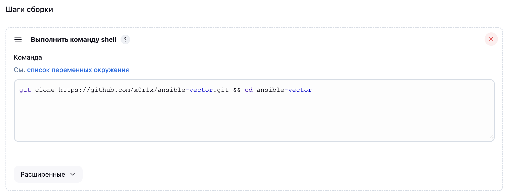

    - запускаем проверку `molecule`

    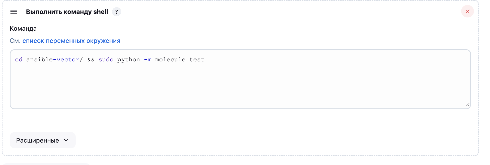

    - Запускаем job

    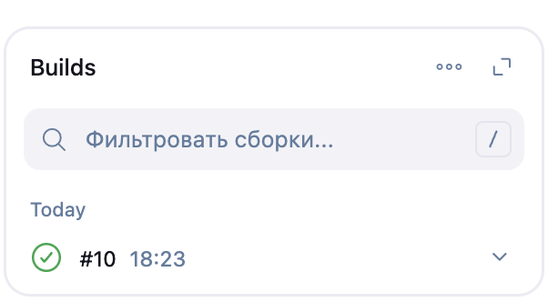

    - Лог запуска [log_10.txt](#10.txt)

2. Создаем `Declarative Pipeline Job` имя `pipline`

    - Создаем два шага выгрузка из репы проверка в `molecule`
    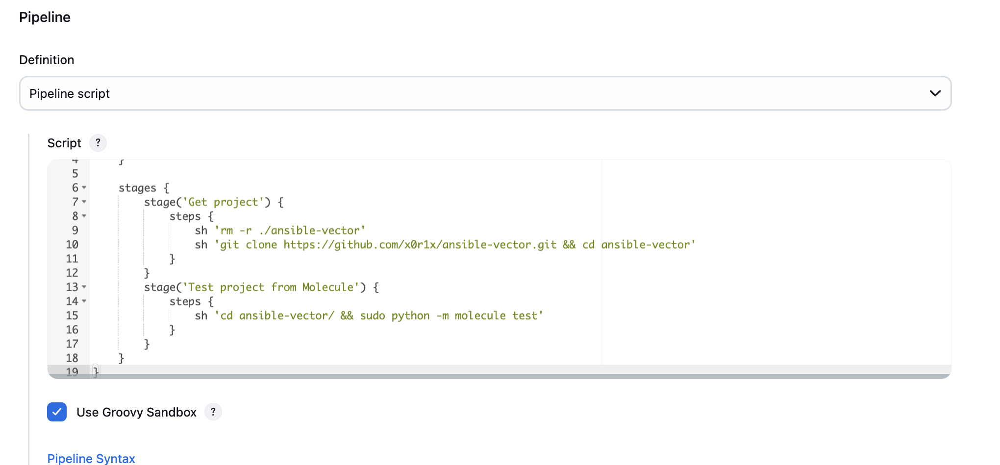

    листинг кода

    ```groovy
    pipeline {
        agent {
        label 'centos'
        }
        
        stages {
            stage('Get project') {
                steps {
                    sh 'rm -rf ./ansible-vector'
                    sh 'git clone https://github.com/x0r1x/ansible-vector.git && cd ansible-vector'
                }
            }
            stage('Test project from Molecule') {
                steps {
                    sh 'cd ansible-vector/ && sudo python -m molecule test'
                }
            }
        }   
    }
    ```

    - Запускаем job

    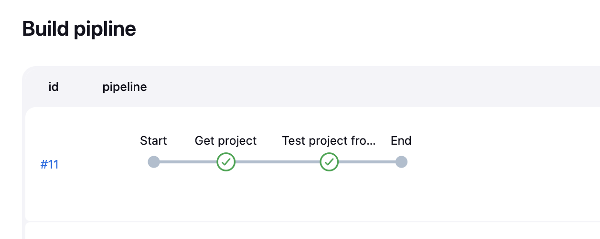

    - Лог запуска [log_11.txt](#11.txt)

3. Переносим pipeline в репозиторий ([линк на репу](https://github.com/x0r1x/mnt-homeworks/blob/x0r1x-patch-1/09-ci-04-jenkins/jenkins_pipeline_repo/Jenkinsfile)) перенастраиваем pipeline на репозиторий, указываем путь до `jenkins` файла

    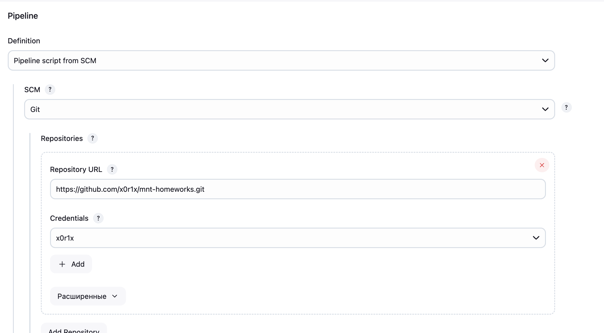
    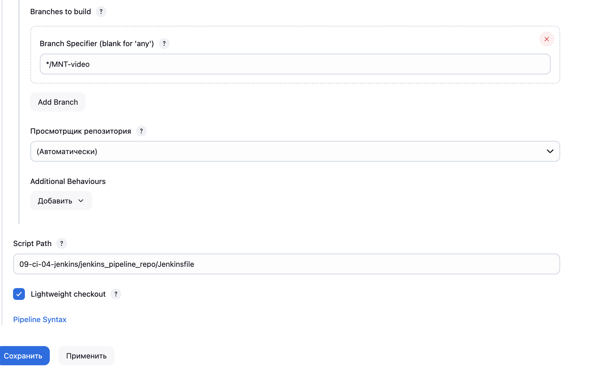

    - запускаем job

    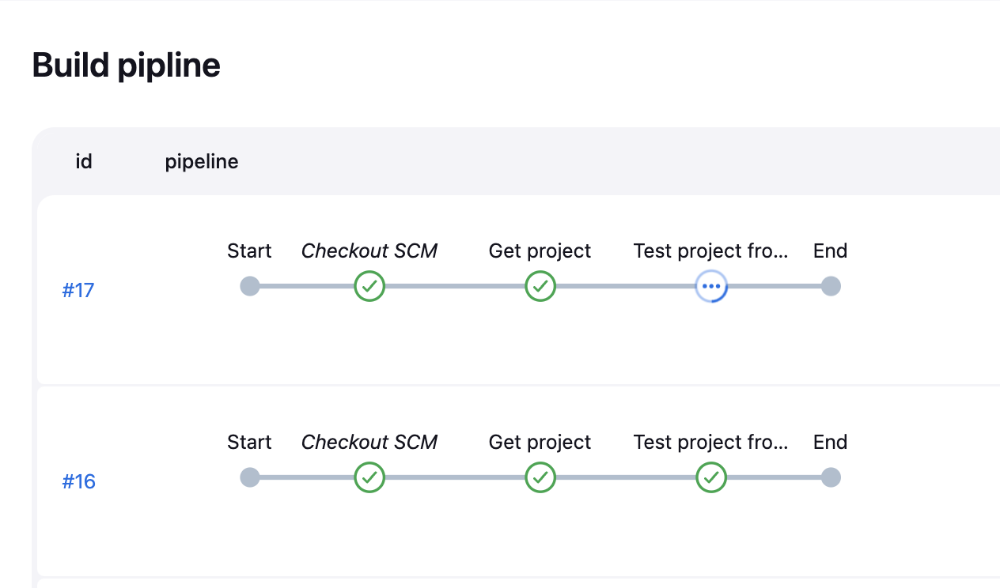

    - Лог запуска [log_17.txt](#17.txt)

4. Проделываем все тоже самое на `Multibranch Pipeline`, создаем `multi_pipe_job` и добавляем отдельный джоб с проверкой `molecule`

    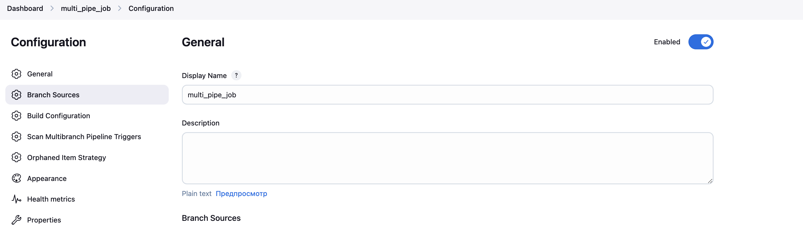
    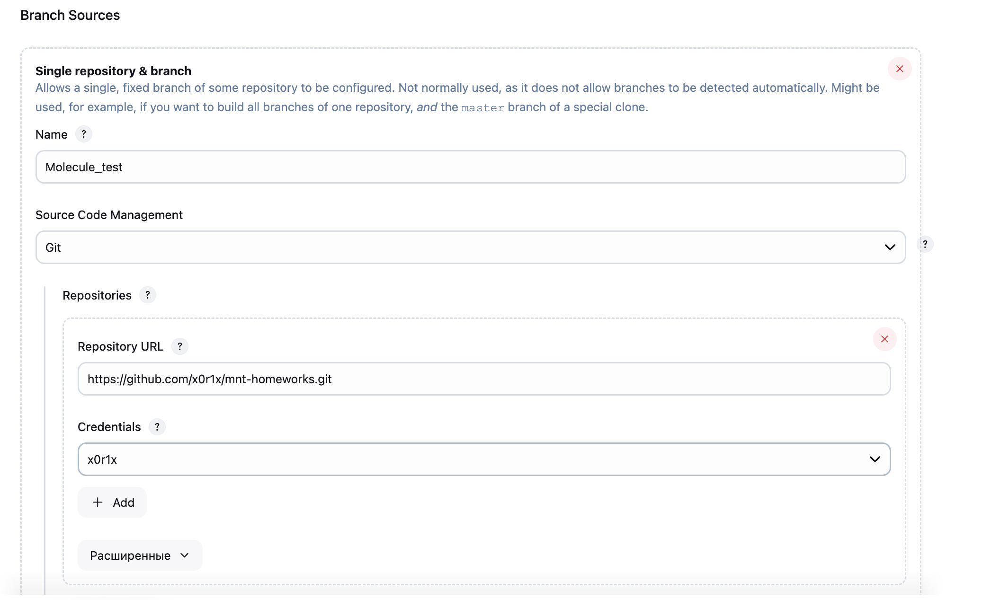
    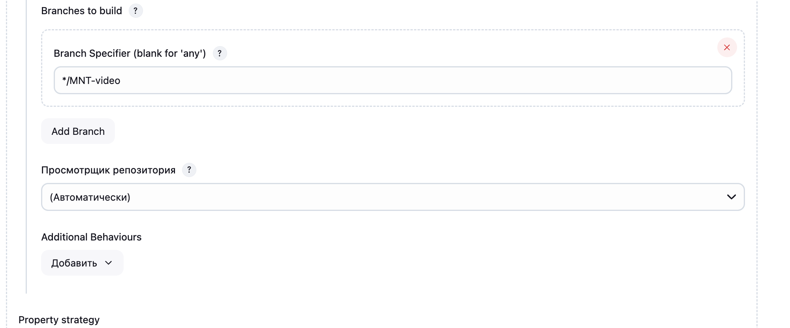
    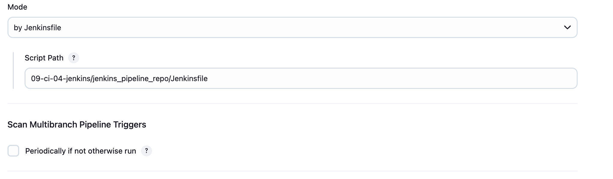

    - запускаем наши джобы (у нас только 1 джоб):

    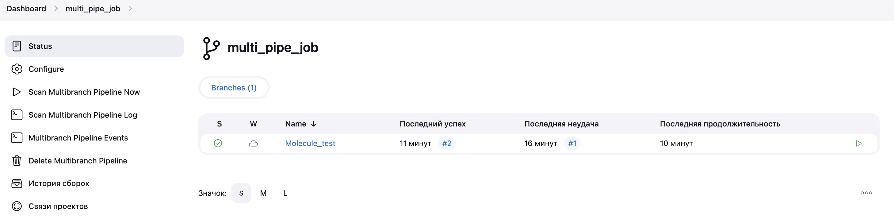

    - Запускаем job 

    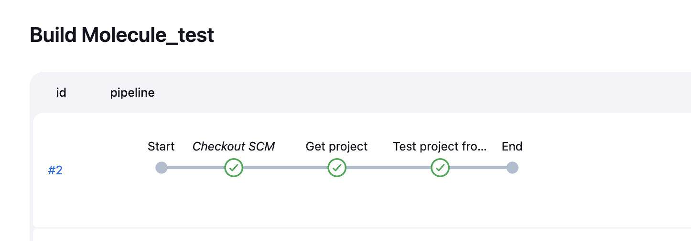

    - Лог запуска [log_2.txt](#2.txt)

5. Создаем `Scripted Pipeline` имя `scripted_job`

    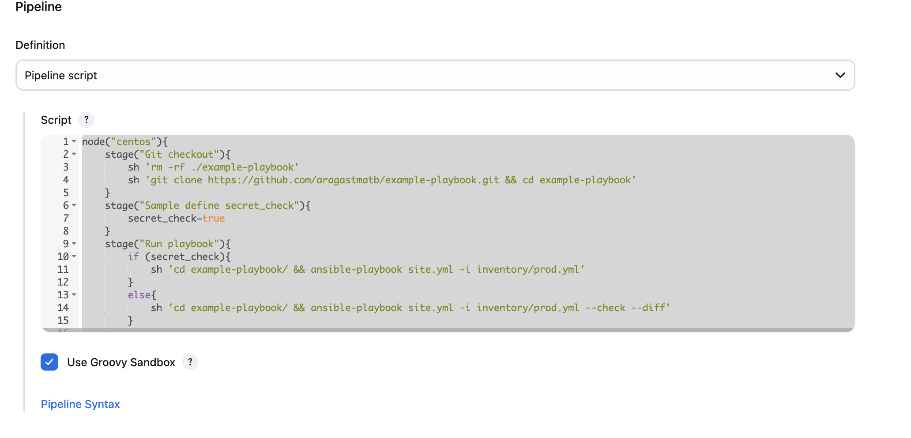

    ```groovy
    node("centos"){
        stage("Git checkout"){
            sh 'rm -rf ./example-playbook'
            sh 'git clone https://github.com/aragastmatb/example-playbook.git && cd example-playbook'
        }
        stage("Sample define secret_check"){
            secret_check=true
        }
        stage("Run playbook"){
            if (secret_check){
                sh 'cd example-playbook/ && ansible-playbook site.yml -i inventory/prod.yml'
            }
            else{
                sh 'cd example-playbook/ && ansible-playbook site.yml -i inventory/prod.yml --check --diff'
            }
            
        }
    }
    ```

    - Запускаем job 

    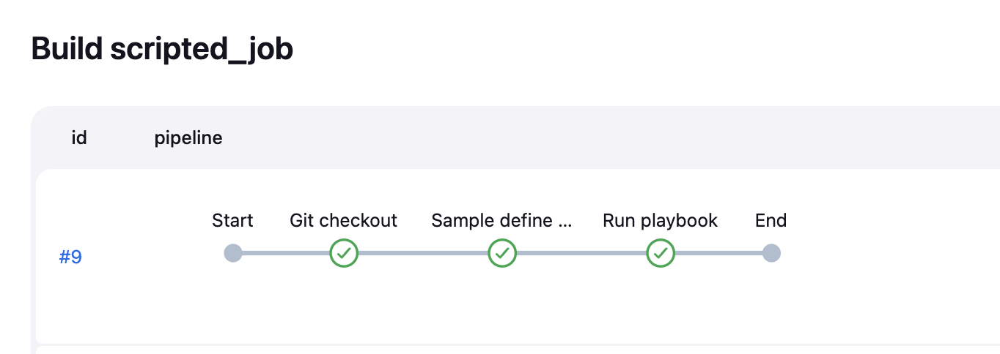

    - Лог запуска [log_9.txt](#9.txt)

## Необязательная часть

1. Создать скрипт на groovy, который будет собирать все Job, завершившиеся хотя бы раз неуспешно. Добавить скрипт в репозиторий с решением и названием `AllJobFailure.groovy`.
2. Создать Scripted Pipeline так, чтобы он мог сначала запустить через Yandex Cloud CLI необходимое количество инстансов, прописать их в инвентори плейбука и после этого запускать плейбук. Мы должны при нажатии кнопки получить готовую к использованию систему.

---

### Как оформить решение задания

Выполненное домашнее задание пришлите в виде ссылки на .md-файл в вашем репозитории.

---
