# Домашнее задание к занятию 11 «Teamcity»

## Подготовка к выполнению

1. В Yandex Cloud создайте новый инстанс (4CPU4RAM) на основе образа `jetbrains/teamcity-server`.
2. Дождитесь запуска teamcity, выполните первоначальную настройку.
3. Создайте ещё один инстанс (2CPU4RAM) на основе образа `jetbrains/teamcity-agent`. Пропишите к нему переменную окружения `SERVER_URL: "http://<teamcity_url>:8111"`.
4. Авторизуйте агент.
5. Сделайте fork [репозитория](https://github.com/aragastmatb/example-teamcity).
6. Создайте VM (2CPU4RAM) и запустите [playbook](./infrastructure).

## Основная часть

1. Создайте новый проект в teamcity на основе fork.
2. Сделайте autodetect конфигурации.
3. Сохраните необходимые шаги, запустите первую сборку master.
4. Поменяйте условия сборки: если сборка по ветке `master`, то должен происходит `mvn clean deploy`, иначе `mvn clean test`.
5. Для deploy будет необходимо загрузить [settings.xml](./teamcity/settings.xml) в набор конфигураций maven у teamcity, предварительно записав туда креды для подключения к nexus.
6. В pom.xml необходимо поменять ссылки на репозиторий и nexus.
7. Запустите сборку по master, убедитесь, что всё прошло успешно и артефакт появился в nexus.
8. Мигрируйте `build configuration` в репозиторий.
9. Создайте отдельную ветку `feature/add_reply` в репозитории.
10. Напишите новый метод для класса Welcomer: метод должен возвращать произвольную реплику, содержащую слово `hunter`.
11. Дополните тест для нового метода на поиск слова `hunter` в новой реплике.
12. Сделайте push всех изменений в новую ветку репозитория.
13. Убедитесь, что сборка самостоятельно запустилась, тесты прошли успешно.
14. Внесите изменения из произвольной ветки `feature/add_reply` в `master` через `Merge`.
15. Убедитесь, что нет собранного артефакта в сборке по ветке `master`.
16. Настройте конфигурацию так, чтобы она собирала `.jar` в артефакты сборки.
17. Проведите повторную сборку мастера, убедитесь, что сбора прошла успешно и артефакты собраны.
18. Проверьте, что конфигурация в репозитории содержит все настройки конфигурации из teamcity.
19. В ответе пришлите ссылку на репозиторий.

#### Решение

- Создаем новый проект в teamcity на основе fork.

    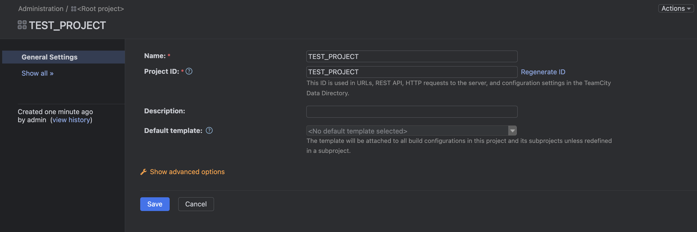

    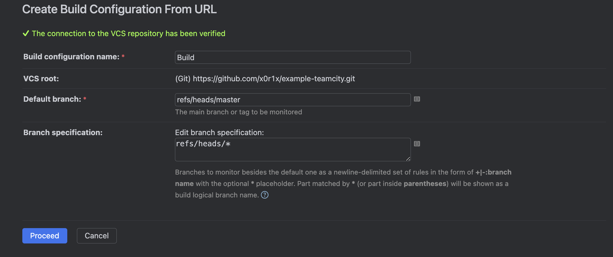

- Делаем autodetect конфигурации.

    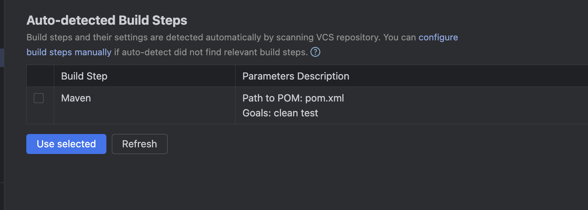

- Запускаем первую сборку master.

    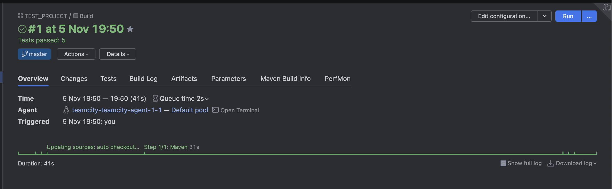

    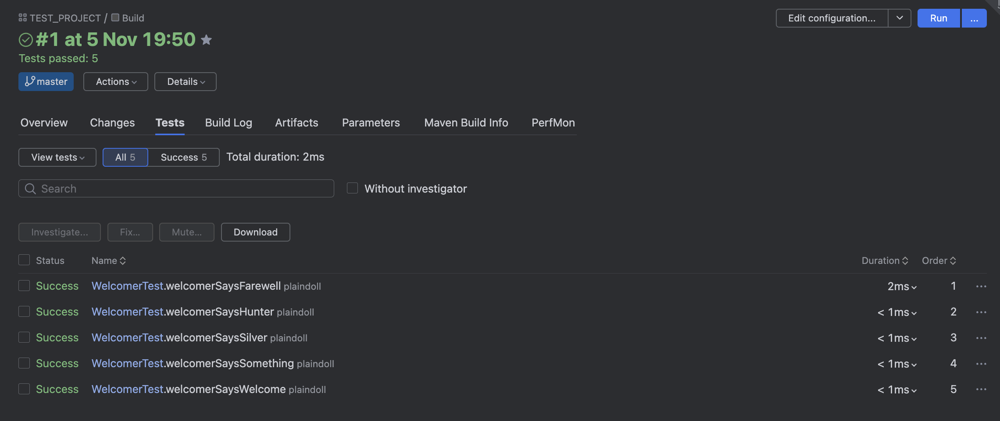

- Меняем условия сборки: если сборка по ветке `master`, то должен происходит `mvn clean deploy`, иначе `mvn clean test`

    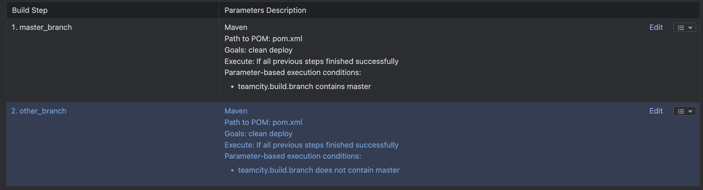

- Для deploy загружаем [settings.xml](./teamcity/settings.xml) в набор конфигураций maven у teamcity, предварительно записав туда креды для подключения к nexus.

    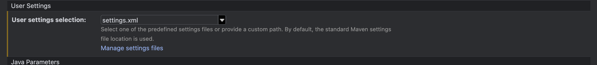

- В pom.xml меням ссылки на репозиторий и nexus, ссылка на [commit](https://github.com/x0r1x/example-teamcity/commit/d01d44b298876e1c3ff68328611a616f7da4de04).

    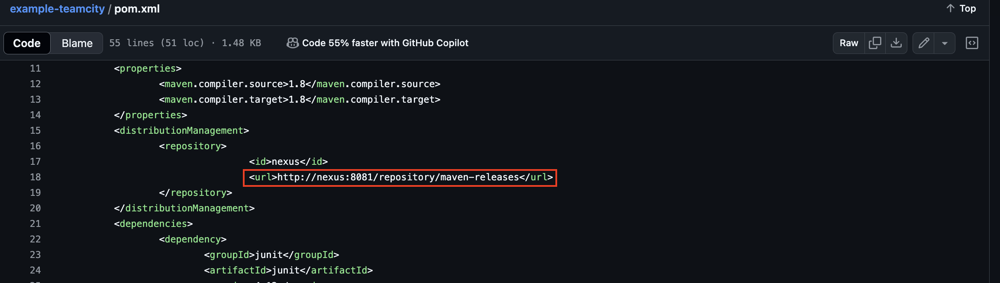

- Убеждаемся что корректно отработла сборка, отработал шаг который собирает только ветку `master`

    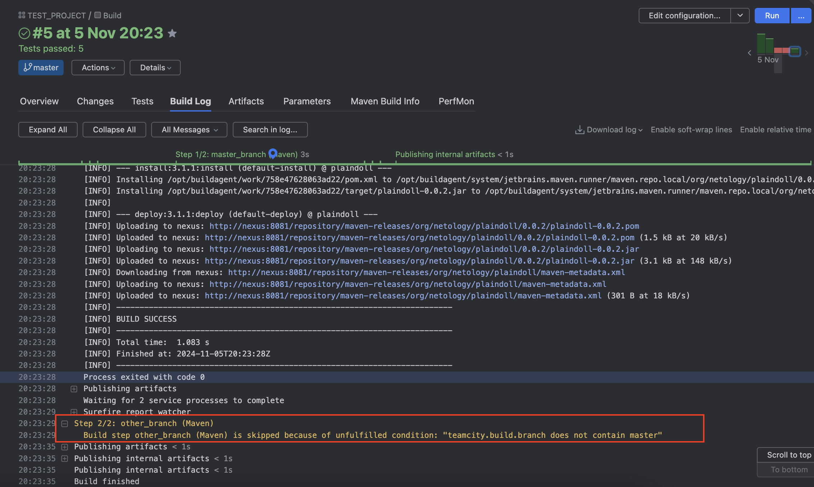

- Убеждаемся, что всё прошло успешно и артефакт появился в nexus.

    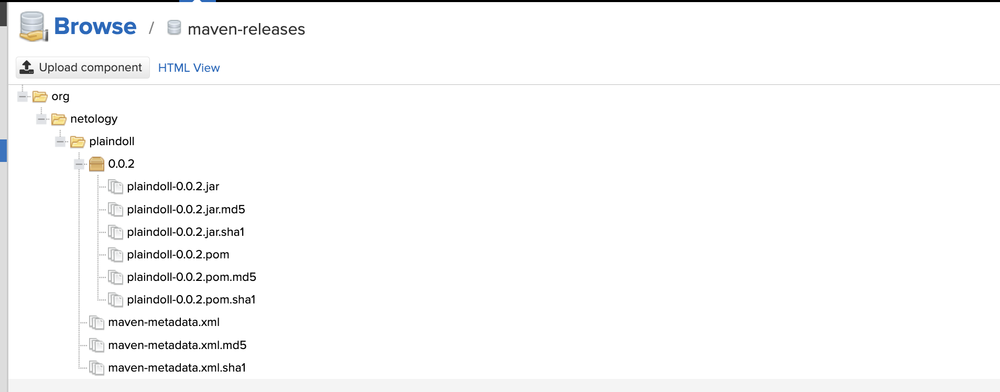

- Мигрируем `build configuration` в репозиторий. ссылка на [commit](https://github.com/x0r1x/example-teamcity/commit/ec89df98ee01c3109647567fbbc96bd33047ff3b)

    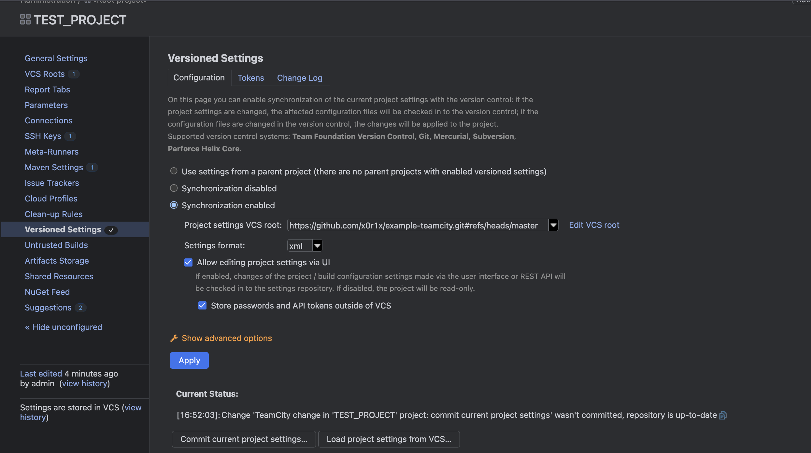

- Проверяем что конфигурация появилась в репозитории

    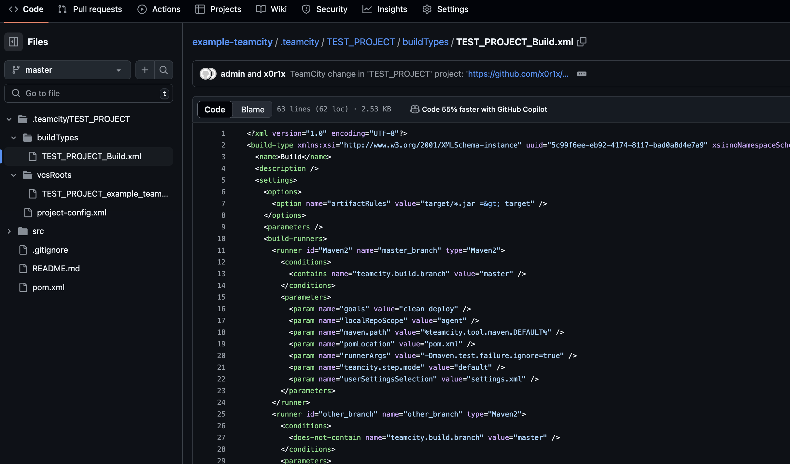

- Напишите новый метод для класса Welcomer: метод должен возвращать произвольную реплику, содержащую слово `hunter`. Дополните тест для нового метода на поиск слова `hunter` в новой реплике. [push](https://github.com/x0r1x/example-teamcity/commit/8fbc2408174a792623275d5ad3dc6a51d661b455)

    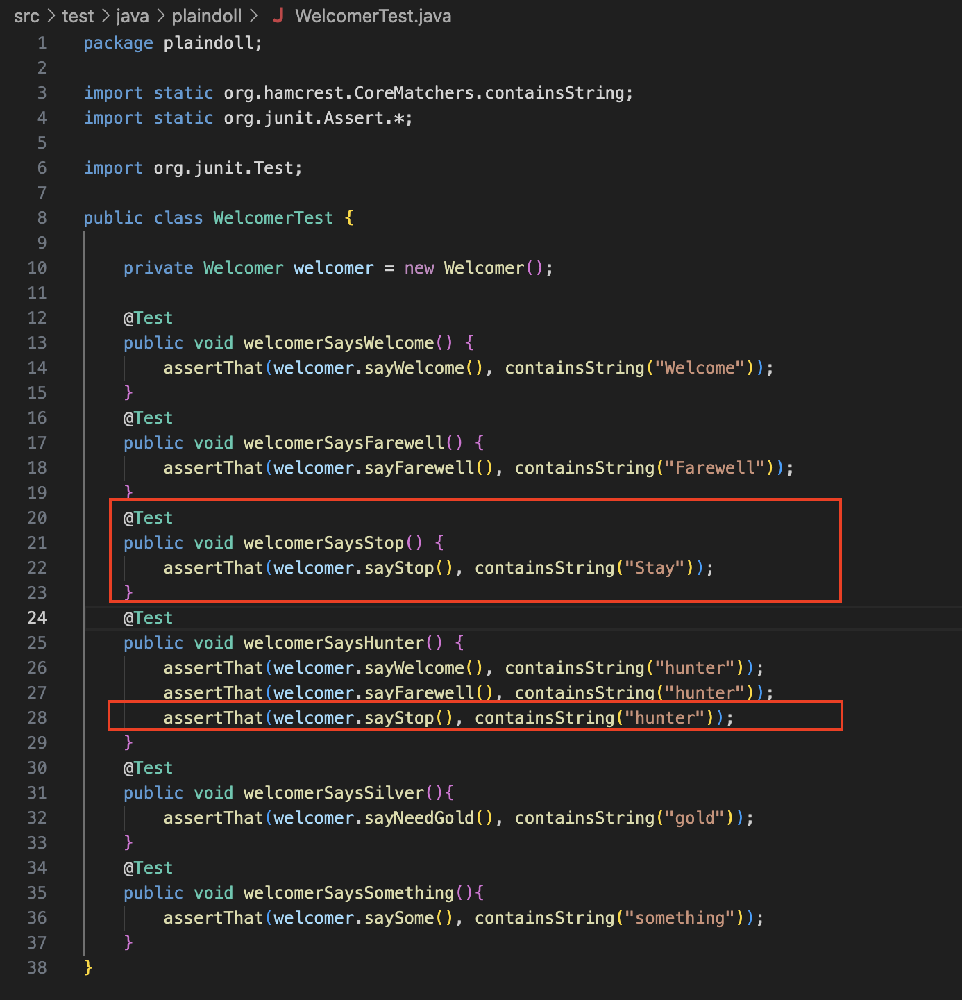

- Делаем push всех изменений в новую ветку репозитория. Убеждаемся, что сборка самостоятельно запустилась, тесты прошли успешно.

    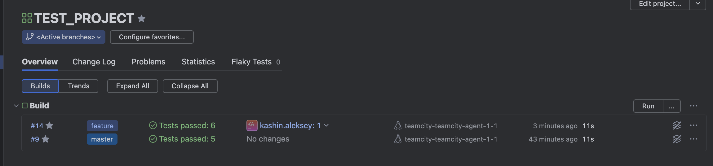

    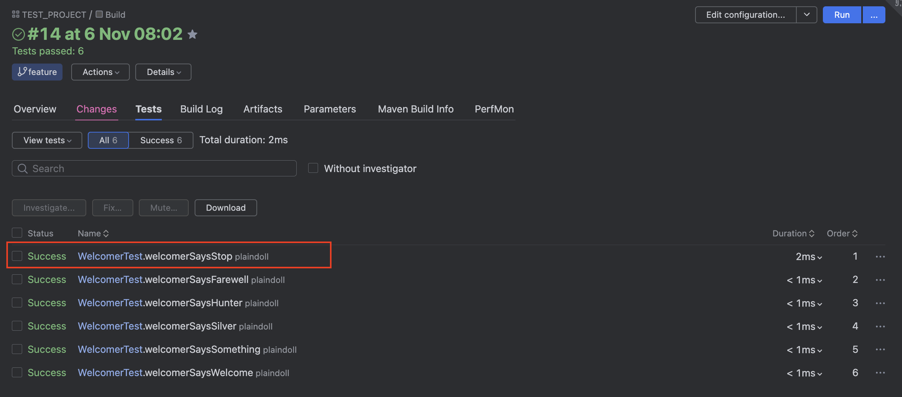

- Шаг который собирает только ветку `feature`

    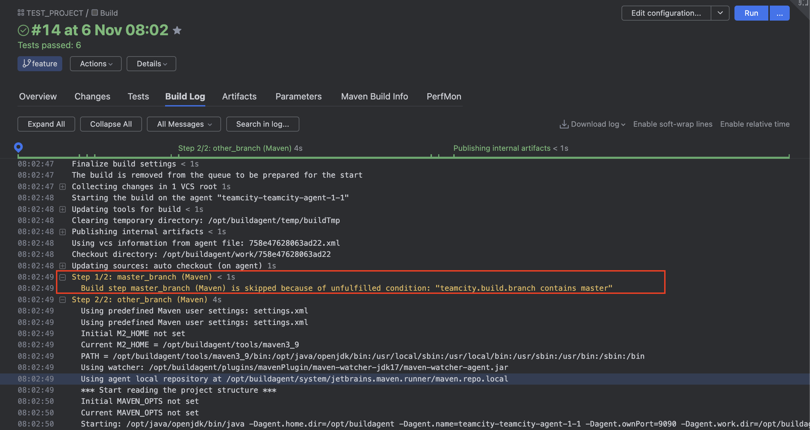

- Вносим изменения из произвольной ветки `feature/add_reply` в `master` через `Merge`. Сделал [pull_request](https://github.com/x0r1x/example-teamcity/pull/1) и мердж в ветку `master`

    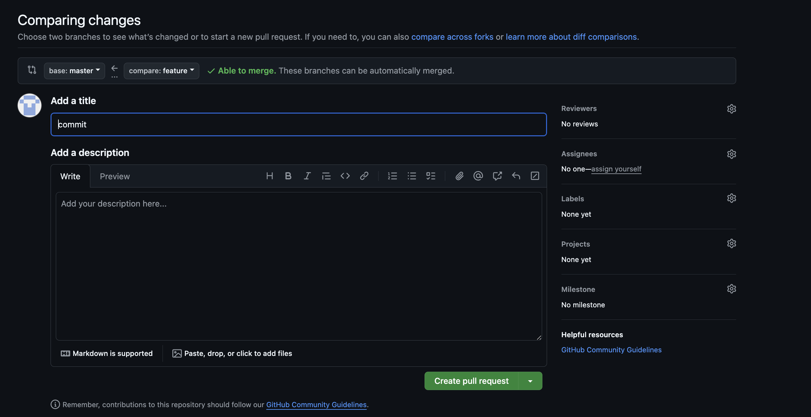

    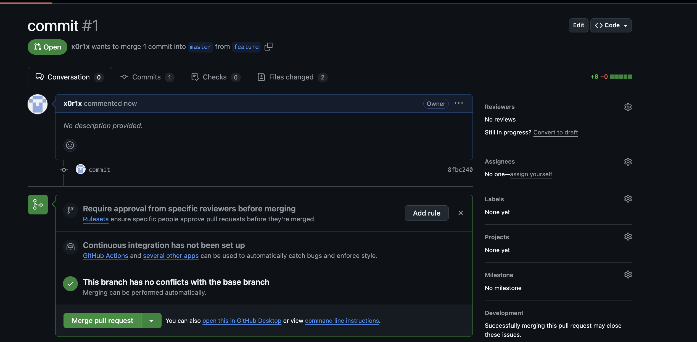

- Убеждаемся, что нет собранного артефакта в сборке по ветке `master`.

    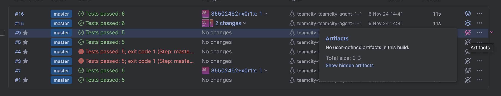

- Настраиваем конфигурацию так, чтобы она собирала `.jar` в артефакты сборки.

    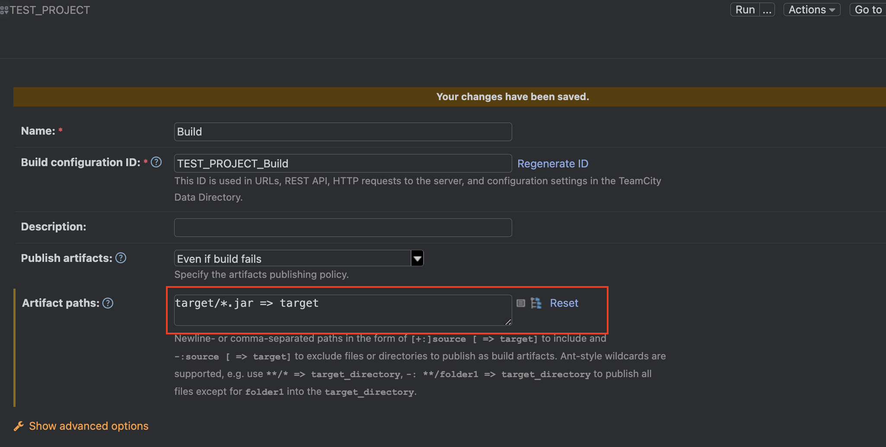

- Запускаем сборку мастера, артефакты собраны.

    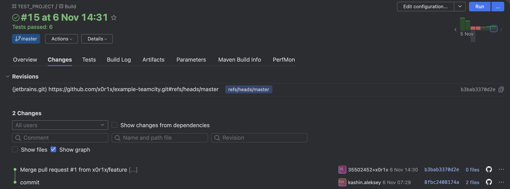

    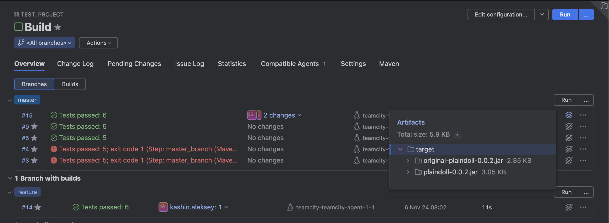

- Проведите повторную сборку мастера, убедитесь, что сбора прошла успешно и артефакты собраны.

    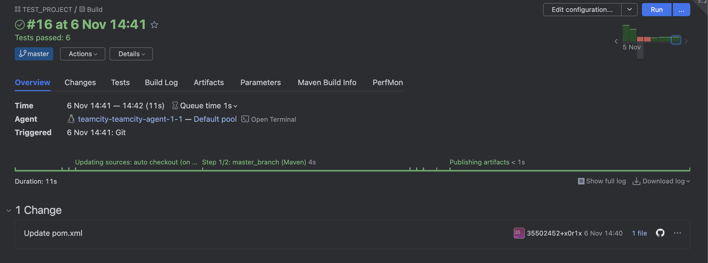

    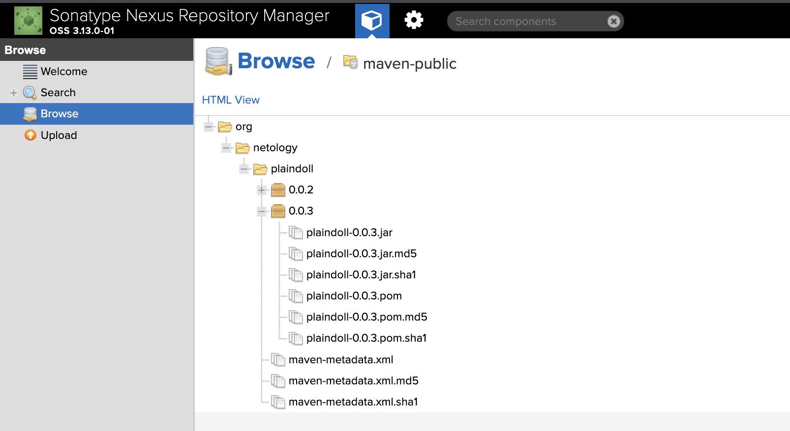

- Ссылка на репозиторий [project_src](https://github.com/x0r1x/example-teamcity.git)
---

### Как оформить решение задания

Выполненное домашнее задание пришлите в виде ссылки на .md-файл в вашем репозитории.

---
