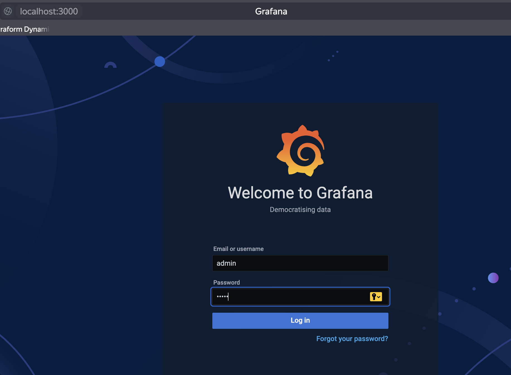
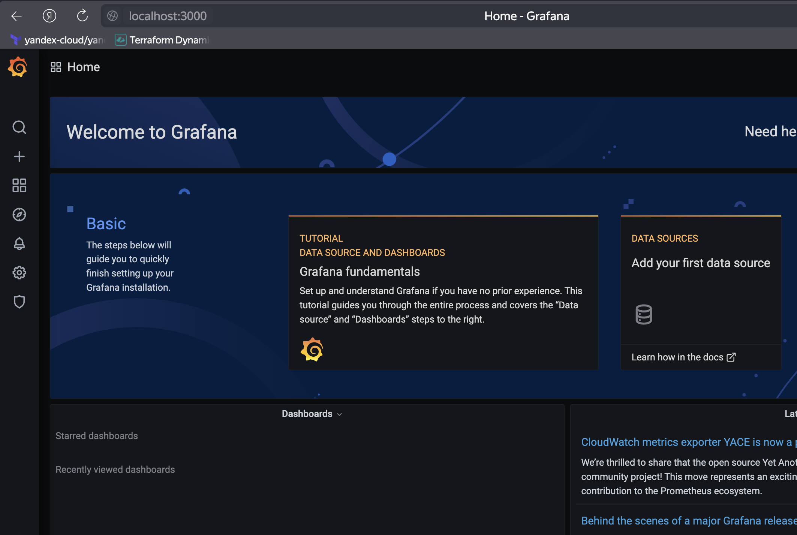
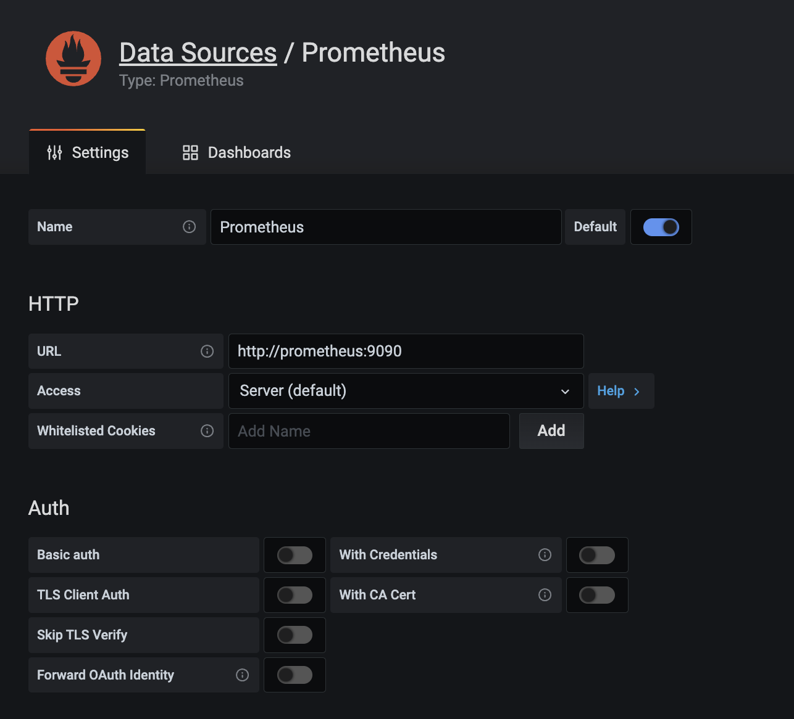
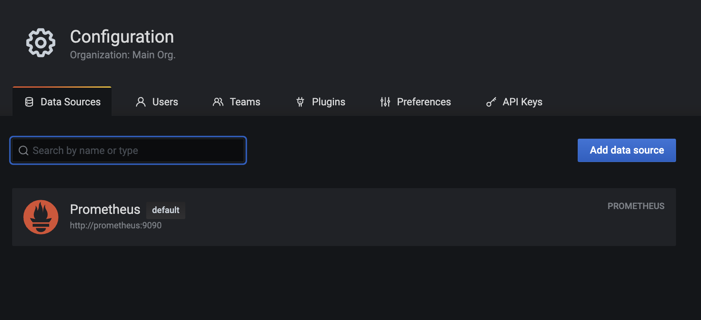
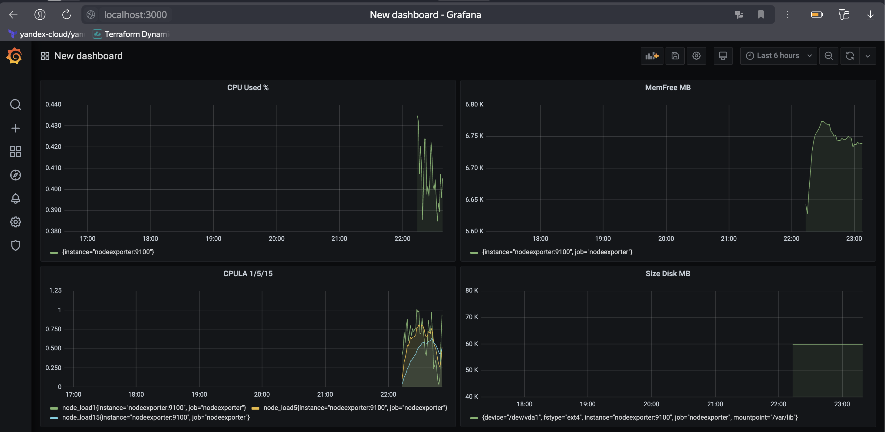
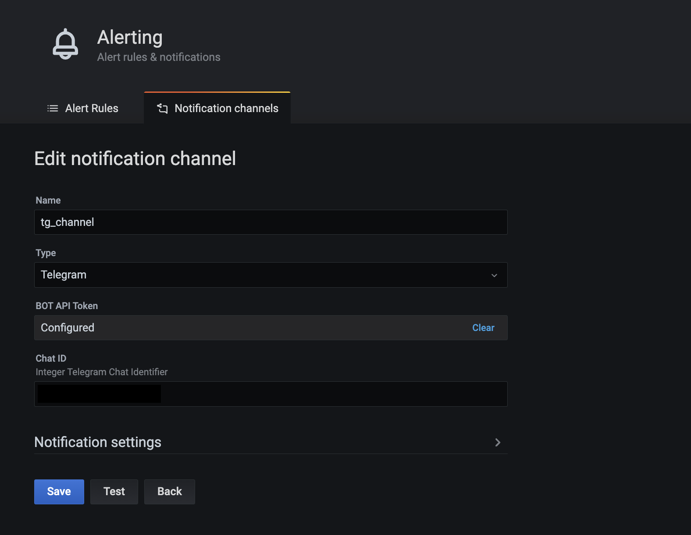
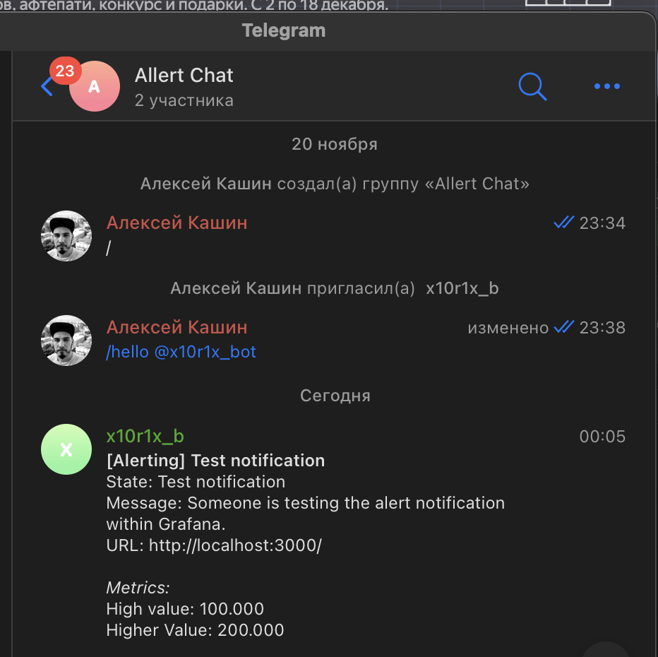
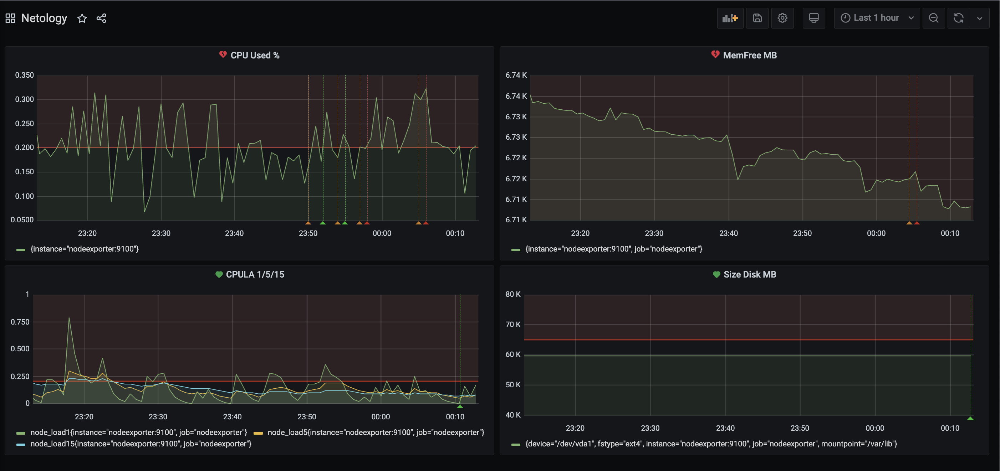
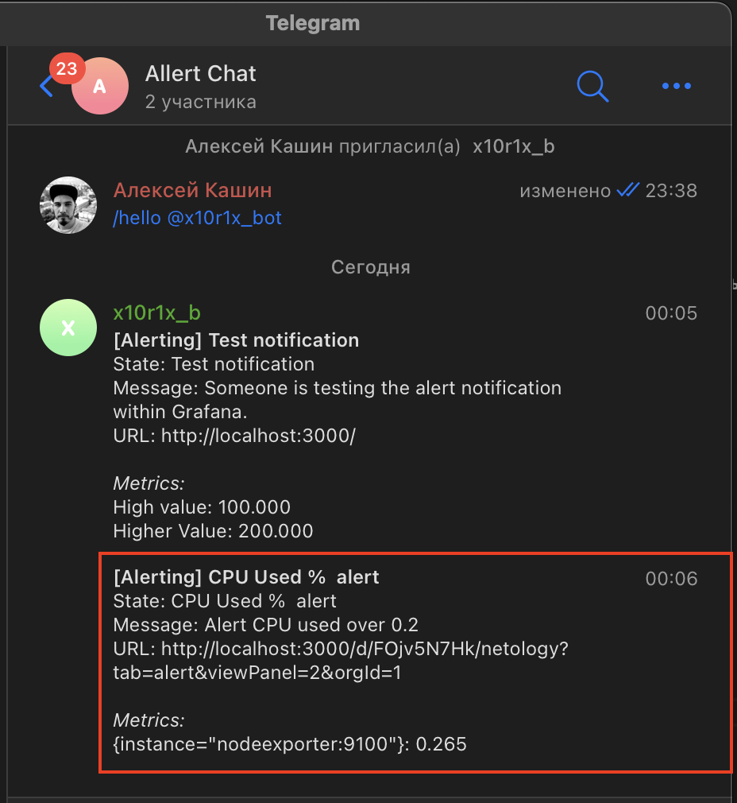

# Домашнее задание к занятию 14 «Средство визуализации Grafana»

## Задание повышенной сложности

**При решении задания 1** не используйте директорию [help](./help) для сборки проекта. Самостоятельно разверните grafana, где в роли источника данных будет выступать prometheus, а сборщиком данных будет node-exporter:

- grafana;
- prometheus-server;
- prometheus node-exporter.

За дополнительными материалами можете обратиться в официальную документацию grafana и prometheus.

В решении к домашнему заданию также приведите все конфигурации, скрипты, манифесты, которые вы 
использовали в процессе решения задания.

**При решении задания 3** вы должны самостоятельно завести удобный для вас канал нотификации, например, Telegram или email, и отправить туда тестовые события.

В решении приведите скриншоты тестовых событий из каналов нотификаций.

## Обязательные задания

### Задание 1

1. Используя директорию [help](./help) внутри этого домашнего задания, запустите связку prometheus-grafana.
2. Зайдите в веб-интерфейс grafana, используя авторизационные данные, указанные в манифесте docker-compose.
3. Подключите поднятый вами prometheus, как источник данных.
4. Решение домашнего задания — скриншот веб-интерфейса grafana со списком подключенных Datasource.

#### Решение 

1. Запускаем prometheus-grafana.

    ```bash
    alekseykashin@MacBook-Pro-Aleksej help % docker-compose up -d
    [+] Running 25/22
    ✔ prometheus Pulled                                                                      48.7s 
    ✔ grafana Pulled                                                                         55.9s 
    ✔ nodeexporter Pulled                                                                    55.1s 
                                                                                                
    [+] Running 5/5
    ✔ Network help_monitor-net    Created                                                     0.0s 
    ✔ Volume "help_grafana_data"  Created                                                     0.0s 
    ✔ Container nodeexporter      Started                                                     0.5s 
    ✔ Container prometheus        Started                                                     0.4s 
    ✔ Container grafana           Started                                                     0.4s 
    alekseykashin@MacBook-Pro-Aleksej help % docker ps
    CONTAINER ID   IMAGE                       COMMAND                  CREATED         STATUS         PORTS                    NAMES
    70e513da58c0   grafana/grafana:7.4.0       "/run.sh"                5 minutes ago   Up 5 minutes   0.0.0.0:3000->3000/tcp   grafana
    21f4ffb16dc3   prom/prometheus:v2.24.1     "/bin/prometheus --c…"   5 minutes ago   Up 5 minutes   9090/tcp                 prometheus
    0c97dbed4d77   prom/node-exporter:v1.0.1   "/bin/node_exporter …"   5 minutes ago   Up 5 minutes   9100/tcp                 nodeexporter
    alekseykashin@MacBook-Pro-Aleksej help % 
    ```

2.Заходим в веб-интерфейс grafana, используя авторизационные данные

    
    

3. Подключаем `datasource` prometheus.



4. Cписок подключенных Datasource к Grafana



## Задание 2

Изучите самостоятельно ресурсы:

1. [PromQL tutorial for beginners and humans](https://valyala.medium.com/promql-tutorial-for-beginners-9ab455142085).
1. [Understanding Machine CPU usage](https://www.robustperception.io/understanding-machine-cpu-usage).
1. [Introduction to PromQL, the Prometheus query language](https://grafana.com/blog/2020/02/04/introduction-to-promql-the-prometheus-query-language/).

Создайте Dashboard и в ней создайте Panels:

- утилизация CPU для nodeexporter (в процентах, 100-idle);
- CPULA 1/5/15;
- количество свободной оперативной памяти;
- количество места на файловой системе.

Для решения этого задания приведите promql-запросы для выдачи этих метрик, а также скриншот получившейся Dashboard.

#### Решение 

Создаем Дашик со следующими панелями:

- утилизация CPU для nodeexporter (в процентах, 100-idle);

```
100 - (avg by (instance) (rate(node_cpu_seconds_total{job="nodeexporter",mode="idle"}[1m])) * 100)
```

- CPULA 1/5/15;

```
node_load1{job="nodeexporter"}
node_load5{job="nodeexporter"}
node_load15{job="nodeexporter"}
```

- количество свободной оперативной памяти;

```
(node_memory_MemFree_bytes{job="nodeexporter"}/1024)/1024
```

- количество места на файловой системе.

```
(node_filesystem_size_bytes{job="nodeexporter",fstype="ext4"}/1024)/1024
```



## Задание 3

1. Создайте для каждой Dashboard подходящее правило alert — можно обратиться к первой лекции в блоке «Мониторинг».
2. В качестве решения задания приведите скриншот вашей итоговой Dashboard.

#### Решение 

1. Создаем группу в Телеграмме, создаем бота, настраеваем конфигурацию алертов, нотификацию через созданного бота и указываем ид группы которую мы создали



тестово проверяем что группа получила сообщение



2. Добавляем аллерты на каждую панель



проверяем что алерт сработал и уведомление пришло в телеграм. 



## Задание 4

1. Сохраните ваш Dashboard.Для этого перейдите в настройки Dashboard, выберите в боковом меню «JSON MODEL». Далее скопируйте отображаемое json-содержимое в отдельный файл и сохраните его.
2. В качестве решения задания приведите листинг этого файла.

#### Решение 

ссылка на проект в Grafana [дашбоард](Dashboard_nettology.json)

---

### Как оформить решение задания

Выполненное домашнее задание пришлите в виде ссылки на .md-файл в вашем репозитории.

---
