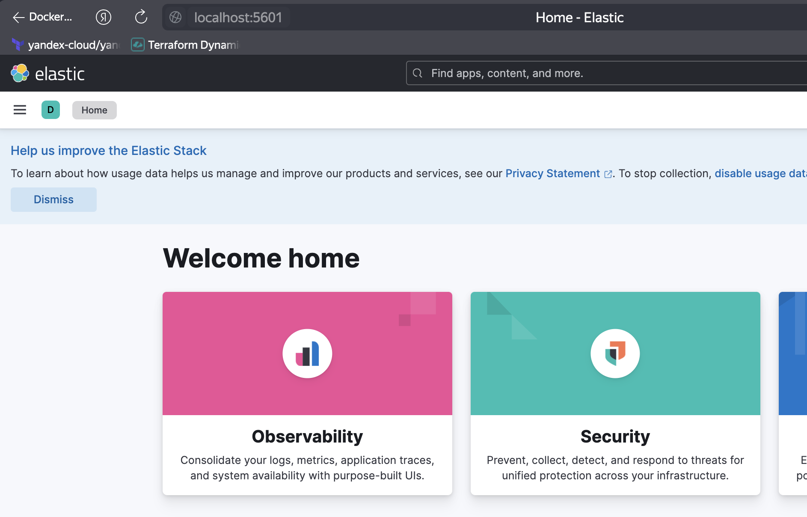
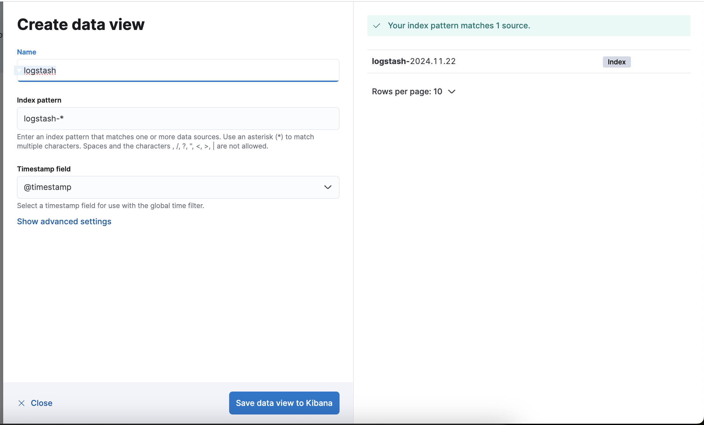
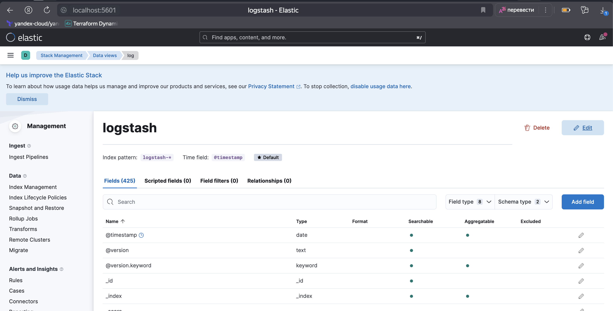
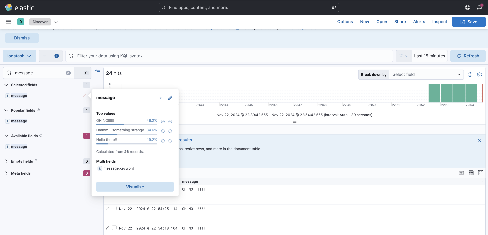
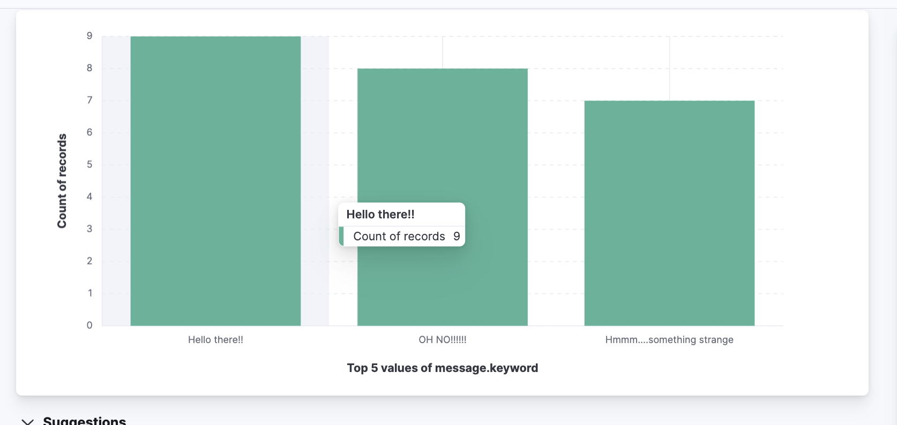

# Домашнее задание к занятию 15 «Система сбора логов Elastic Stack»

## Дополнительные ссылки

При выполнении задания используйте дополнительные ресурсы:

- [поднимаем elk в docker](https://www.elastic.co/guide/en/elastic-stack-get-started/current/get-started-docker.html);
- [поднимаем elk в docker с filebeat и docker-логами](https://www.sarulabs.com/post/5/2019-08-12/sending-docker-logs-to-elasticsearch-and-kibana-with-filebeat.html);
- [конфигурируем logstash](https://www.elastic.co/guide/en/logstash/current/configuration.html);
- [плагины filter для logstash](https://www.elastic.co/guide/en/logstash/current/filter-plugins.html);
- [конфигурируем filebeat](https://www.elastic.co/guide/en/beats/libbeat/5.3/config-file-format.html);
- [привязываем индексы из elastic в kibana](https://www.elastic.co/guide/en/kibana/current/index-patterns.html);
- [как просматривать логи в kibana](https://www.elastic.co/guide/en/kibana/current/discover.html);
- [решение ошибки increase vm.max_map_count elasticsearch](https://stackoverflow.com/questions/42889241/how-to-increase-vm-max-map-count).

В процессе выполнения в зависимости от системы могут также возникнуть не указанные здесь проблемы.

Используйте output stdout filebeat/kibana и api elasticsearch для изучения корня проблемы и её устранения.

## Задание повышенной сложности

Не используйте директорию [help](./help) при выполнении домашнего задания.

## Задание 1

Вам необходимо поднять в докере и связать между собой:

- elasticsearch (hot и warm ноды);
- logstash;
- kibana;
- filebeat.

Logstash следует сконфигурировать для приёма по tcp json-сообщений.

Filebeat следует сконфигурировать для отправки логов docker вашей системы в logstash.

В директории [help](./help) находится манифест docker-compose и конфигурации filebeat/logstash для быстрого 
выполнения этого задания.

Результатом выполнения задания должны быть:

- скриншот `docker ps` через 5 минут после старта всех контейнеров (их должно быть 5);
- скриншот интерфейса kibana;
- docker-compose манифест (если вы не использовали директорию help);
- ваши yml-конфигурации для стека (если вы не использовали директорию help).

#### Решение 

- скриншот `docker ps` через 5 минут после старта всех контейнеров (их должно быть 5);

```bash 
alekseykashin@MacBook-Pro-Aleksej help % docker ps
CONTAINER ID   IMAGE                     COMMAND                  CREATED         STATUS         PORTS                                                      NAMES
b2c2fd9d3b9c   elastic/filebeat:8.16.1   "/usr/bin/tini -- /u…"   6 minutes ago   Up 6 minutes                                                              filebeat
41c8c837b5c3   kibana:8.7.0              "/bin/tini -- /usr/l…"   6 minutes ago   Up 6 minutes   0.0.0.0:5601->5601/tcp                                     kibana
5b6c0aed4a2e   logstash:8.15.4           "/usr/local/bin/dock…"   6 minutes ago   Up 6 minutes   0.0.0.0:5044->5044/tcp, 0.0.0.0:5046->5046/tcp, 9600/tcp   logstash
4eac5467ae7d   elasticsearch:8.16.0      "/bin/tini -- /usr/l…"   6 minutes ago   Up 6 minutes   0.0.0.0:9200->9200/tcp, 9300/tcp                           es-hot
f4e76e213915   elasticsearch:8.16.0      "/bin/tini -- /usr/l…"   6 minutes ago   Up 6 minutes   9200/tcp, 9300/tcp                                         es-warm
a2d873a3fcc9   python:3.9-alpine         "python3 /opt/app/ru…"   6 minutes ago   Up 6 minutes                                                              some_app
alekseykashin@MacBook-Pro-Aleksej help % 
```

- скриншот интерфейса kibana;



- docker-compose манифест;

```yml
alekseykashin@MacBook-Pro-Aleksej help % cat docker-compose.yml 
##Предварительно выполнить на Linux хосте команду: sudo sysctl -w vm.max_map_count=262144
##https://www.elastic.co/guide/en/elasticsearch/reference/current/docker.html#_set_vm_max_map_count_to_at_least_262144
#
##kibana address: http://127.0.0.1:5601 будет доступно через ~1-2 мин
#
#
#version: '2.2'
services:

  es-hot:
    image: elasticsearch:8.16.0
    container_name: es-hot
    environment:
      - node.name=es-hot
      - cluster.name=es-docker-cluster
      - discovery.seed_hosts=es-hot,es-warm
      - cluster.initial_master_nodes=es-hot,es-warm
      - node.roles=master,data_content,data_hot  
      - "ES_JAVA_OPTS=-Xms512m -Xmx512m"
      - "http.host=0.0.0.0"
      - xpack.security.enabled=false
    volumes:
      - data01:/usr/share/elasticsearch/data:Z
    ulimits:
      memlock:
        soft: -1
        hard: -1
      nofile:
        soft: 65536
        hard: 65536
    ports:
      - 9200:9200
    networks:
      - elastic
    depends_on:
      - es-warm

  es-warm:
    image: elasticsearch:8.16.0
    container_name: es-warm
    environment:
      - node.name=es-warm
      - cluster.name=es-docker-cluster
      - discovery.seed_hosts=es-hot,es-warm
      - cluster.initial_master_nodes=es-hot,es-warm
      - node.roles=master,data_warm
      - "ES_JAVA_OPTS=-Xms512m -Xmx512m"
      - xpack.security.enabled=false
      - xpack.ml.use_auto_machine_memory_percent=true
      - "http.host=0.0.0.0"
    volumes:
      - data02:/usr/share/elasticsearch/data:Z
    ulimits:
      memlock:
        soft: -1
        hard: -1
      nofile:
        soft: 65536
        hard: 65536
    networks:
      - elastic

  kibana:
    image: kibana:8.7.0
    container_name: kibana
    ports:
      - 5601:5601
    environment:
      ELASTICSEARCH_URL: http://es-hot:9200
      ELASTICSEARCH_HOSTS: '["http://es-hot:9200","http://es-warm:9200"]'
    networks:
      - elastic
    depends_on:
      - es-hot
      - es-warm

  logstash:
    image: logstash:8.15.4
    container_name: logstash
    environment:
      - "LS_JAVA_OPTS=-Xms256m -Xmx256m"
    ports:
      - 5046:5046
      - 5044:5044
    volumes:
      - ./configs/logstash.conf:/usr/share/logstash/pipeline/logstash.conf:Z
      - ./configs/logstash.yml:/opt/logstash/config/logstash.yml:Z
    networks:
      - elastic
    depends_on:
      - es-hot
      - es-warm

  filebeat:
    image: elastic/filebeat:8.16.1
    container_name: filebeat
    privileged: true
    user: root
    command: filebeat -e -strict.perms=false
    volumes:
      - ./configs/filebeat.yml:/usr/share/filebeat/filebeat.yml:Z
      - data03:/opt/log:Z
      # - /var/lib/docker:/var/lib/docker:Z
      # - /var/run/docker.sock:/var/run/docker.sock:Z
    depends_on:
      - logstash
    networks:
      - elastic

  some_application:
    image: library/python:3.9-alpine
    container_name: some_app
    privileged: true
    user: root
    command: 
      - "mkdir /opt/app"
    volumes:
      - ./pinger/:/opt/app/:Z
      - data03:/opt/log:Z
    entrypoint: python3 /opt/app/run.py

volumes:
  data01:
    driver: local
  data02:
    driver: local
  data03:
    driver: local

networks:
  elastic:
    driver: bridge
```

- yml-конфигурации для filebeat, переключил на чтение фалика с логами которых храниться в volume data03 т.к. у меня проблема с докер сокетом на тачке.

```yml
alekseykashin@MacBook-Pro-Aleksej configs % cat filebeat.yml
filebeat.inputs:
  - type: log
    enabled: true
    paths:
      - /opt/log/app.log
  # - type: container
  #   paths:
  #     - '/var/lib/docker/containers/*/*.log'

# processors:
#   - add_docker_metadata:
#       host: "unix:///var/run/docker.sock"

#   - decode_json_fields:
#       fields: ["message"]
#       target: "json"
#       overwrite_keys: true

output.logstash:
  hosts: ["logstash:5046"]
  protocol: tcp

logging.json: true
logging.metrics.enabled: false
```

- yml-конфигурации для logstash, указываем где лежат логи `message` и временной ряд. 

```conf
alekseykashin@MacBook-Pro-Aleksej configs % cat logstash.conf
input {
  beats {
    port => 5046
  }
}

filter{
  json{
      source => "message"
   }
  date {
    match => ["time", "yyyy-MM-dd HH:mm:ss,SSS"]
    timezone => "UTC"
    target => "@timestamp"
    remove_field => ["time"]
  }
}

output {
  elasticsearch { 
    hosts => ["es-hot:9200"]
    index => "logstash-%{+YYYY.MM.dd}"
  }
  stdout { 
    codec => rubydebug 
  }
}
alekseykashin@MacBook-Pro-Aleksej configs % 
```

- Настраиваемл логгер и файловый обработчик, добавляем сборщика логгов который будет собирать логи в файл `app.log`

```py
alekseykashin@MacBook-Pro-Aleksej pinger % cat run.py 
#!/usr/bin/env python3

import logging
import random
import time
import json
import os

BASE_DIR = os.path.dirname(os.path.abspath(__file__))

logger=logging.getLogger()
logger.setLevel(logging.DEBUG)

file_handler=logging.FileHandler('/opt/log/app.log')
stream_handler=logging.StreamHandler()

stream_formatter=logging.Formatter(
    '%(asctime)-15s %(levelname)-8s %(message)s')
file_formatter=logging.Formatter(
    "{\"time\": \"%(asctime)s\", \"name\": \"%(name)s\", \"level\": \"%(levelname)s\", \"message\": \"%(message)s\"}"
)

file_handler.setFormatter(file_formatter)
stream_handler.setFormatter(stream_formatter)

logger.addHandler(file_handler)
logger.addHandler(stream_handler)

while True:

    time.sleep(5)
    
    number = random.randrange(0, 3)

    if number == 0:
        logger.info('Hello there!!')
    elif number == 1:
        logger.warning('Hmmm....something strange')
    elif number == 2:
        logger.error('OH NO!!!!!!')
    elif number == 3:
        logger.exception(Exception('this is exception'))
alekseykashin@MacBook-Pro-Aleksej pinger % 
```

- Пример записи в файлик `app.log`

```
{"time": "2024-11-22 19:52:32,528", "name": "root", "level": "INFO", "message": "Hello there!!"}
{"time": "2024-11-22 19:52:37,535", "name": "root", "level": "WARNING", "message": "Hmmm....something strange"}
{"time": "2024-11-22 19:52:42,540", "name": "root", "level": "INFO", "message": "Hello there!!"}
{"time": "2024-11-22 19:52:47,542", "name": "root", "level": "INFO", "message": "Hello there!!"}
{"time": "2024-11-22 19:52:52,549", "name": "root", "level": "WARNING", "message": "Hmmm....something strange"}
{"time": "2024-11-22 19:52:57,557", "name": "root", "level": "WARNING", "message": "Hmmm....something strange"}
{"time": "2024-11-22 19:53:02,566", "name": "root", "level": "ERROR", "message": "OH NO!!!!!!"}
{"time": "2024-11-22 19:53:07,572", "name": "root", "level": "ERROR", "message": "OH NO!!!!!!"}
```

## Задание 2

Перейдите в меню [создания index-patterns  в kibana](http://localhost:5601/app/management/kibana/indexPatterns/create) и создайте несколько index-patterns из имеющихся.

Перейдите в меню просмотра логов в kibana (Discover) и самостоятельно изучите, как отображаются логи и как производить поиск по логам.

В манифесте директории help также приведенно dummy-приложение, которое генерирует рандомные события в stdout-контейнера.
Эти логи должны порождать индекс logstash-* в elasticsearch. Если этого индекса нет — воспользуйтесь советами и источниками из раздела «Дополнительные ссылки» этого задания.

#### Решение 

1. Добаил `DataView`



2. Проверяем что логи пишуться


---

### Как оформить решение задания

Выполненное домашнее задание пришлите в виде ссылки на .md-файл в вашем репозитории.

---

 
